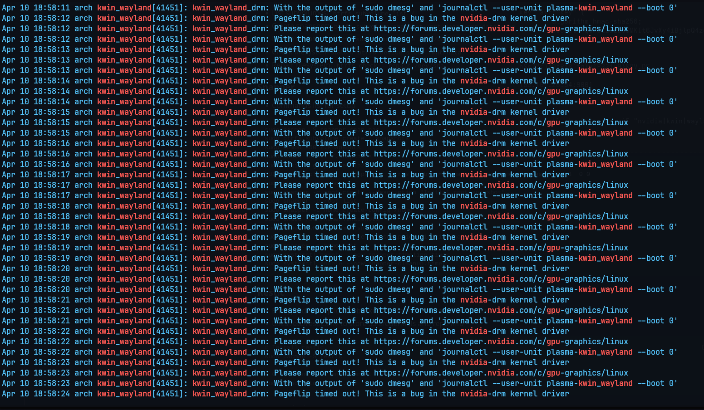

# 📌 Known Issues

This document tracks recurring bugs, hardware quirks, and compatibility issues across the system — particularly those related to NVIDIA, KDE, Wayland, or kernel behavior. Each entry links to a full Markdown page with technical details, logs, and workarounds.


---

## 🔼️ KDE + Wayland + NVIDIA Open Driver: Monitor Freeze (Pageflip Timeout)

- **Issue:** In multi-Monitor setup random monitor will freeze when running KDE on Wayland using the NVIDIA Open Kernel Driver.
- **Systems Affected:**
  - `linux-zen`, `linux-tkg-eevdf` (multiple custom kernels tested)
  - NVIDIA Open DKMS 570.x series (confirmed on latest versions)
- **Symptom:** One or more monitors freeze while the system continues running (audio, background apps still functional).
- **Log Message:**
  ```bash
  kwin_wayland_drm: Pageflip timed out! This is a bug in the nvidia-drm kernel driver
  ```
- **Temporary Workaround:** 
  - Switch to a TTY: `Ctrl+Alt+F3`
  - Return to session: `Ctrl+Alt+F1`
  - Log off / Log on
  - reboot
- **Screenshot:**  
  

- **Notes:**
  - Also occurs with official Arch-provided kernels, not just custom ones.
  - May be influenced by GSP firmware toggle (`NVreg_EnableGpuFirmware`) or PSR settings. I've tried a few variations but no concrete fix yet
  - Root cause appears to be in the `nvidia-drm` driver or how KWin (KDE) interacts with it under Wayland.

- **More info:** See [`kde/pageflip-freeze.md`](kde/pageflip-freeze.md) for boot parameters, log samples, and tweak experiments.

---

## How to Use This Directory

When encountering new bugs or driver regressions:
1. **Log it here** with a short summary and pointer to a deeper file.
2. Add supporting images to the `/assets/` folder.
3. Link it to affected components (e.g., KDE, NVIDIA, kernel).

> Prefer to keep lengthy details in their own files for maintainability.

---

## 🔄 To-Do / Candidate Issues:
- NVIDIA GSP Firmware toggle confusion (`NVreg_EnableGpuFirmware=0` vs `1`)
- Wayland + PipeWire + Screenshot bugs (Spectacle)
- TKG-specific scheduler behavior edge cases?

Feel free to append more issues as they appear or track experimental fixes!

