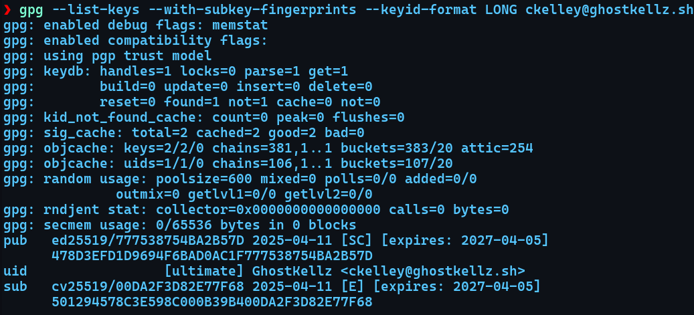
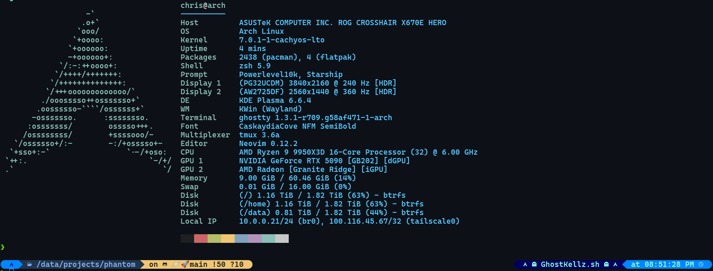
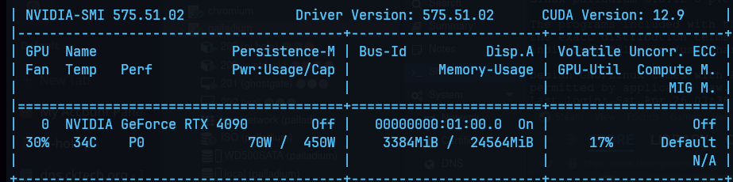

# CK Arch Linux Repository

This repository is a structured collection of configuration files, reference guides, and scripts used to set up and maintain Arch Linux across various use cases, including backup automation, NVIDIA performance tweaks, and personalized dotfiles.

---

## 📂 Repository Structure

```
arch/
├── cheatsheet.md              # General-purpose command and fix reference
├── git-cheatsheet.md          # Basic Git usage tips
├── nvim-cheatsheet.md         # Neovim configuration and plugin commands
├── zsh-cheatsheet.md          # Zsh basics, plugins, and shortcuts

├── scripts/                   # Modular post-install script for configuring system packages

├── btrfs/                     # Snapper and backup strategies using BTRFS
│   └── snapper/               # Root snapper config and layout

├── dotfiles/                  # Shell and app config files
│   ├── nvim/                  # LazyVim setup with Lua config
│   ├── wezterm/               # WezTerm themes, colors, and config
│   ├── zsh/                   # Modular Zsh configuration
│   │   ├── .zshrc             # Main Zsh config (Starship + NVIDIA + loader)
│   │   ├── starship.toml      # Starship prompt theming
│   │   ├── bootstrap.sh       # Zsh bootstrap script (symlinks, plugin setup, etc.)
│   │   ├── .zshrc.d/          # Modular aliases and functions
│   │   │   ├── docker.zsh
│   │   │   ├── git-aliases.zsh
│   │   │   ├── restic.zsh
│   │   │   ├── snapper.zsh
│   │   │   ├── system.zsh
│   │   │   └── wezterm.zsh
│   └── oh-my-zsh/             # Custom plugins/themes (not full Oh My Zsh install)
│       └── custom/
│           ├── plugins/
│           │   ├── zsh-autosuggestions/
│           │   └── zsh-syntax-highlighting/
│           └── themes/
│               └── your-theme.zsh-theme
├── .bashrc                    # Bash configuration (fallback)

├── restic/                    # Restic systemd service/timer and env vars
├── nvidia/                    # NVIDIA-specific tweaks and fixes
├── networking/                # Network configs (Headscale, Tailnet, NGINX, etc.)
├── system/                    # System-wide tuning (ZRAM, systemd, memory, kernel)
│   ├── kernel/                # Kernel tweaks and boot configuration
│   │   ├── tkg/               # Custom bootloader entry and customization.cfg
│   │   └── kernel-params.md   # Boot parameter summary
│   ├── io.md                  # I/O scheduler tweaks and disk settings
│   ├── memory.md              # ZRAM, swappiness, and caching behavior
│   ├── power.md               # Power profiles, suspend tuning
│   └── systemd.md             # Systemd timers, journal, and overrides

├── virtualization/            # QEMU, passthrough, and Libvirt tuning
│   ├── kvm.md
│   ├── libvirt.md
│   ├── passthrough.md
│   └── tweaks.md

├── kde/                       # KDE-specific quirks, bugs, and tuning (Wayland-specific)
│   ├── README.md              # KDE + Wayland + NVIDIA freeze fix (pageflip)
│   └── known_issues.md        # Known issues tracking (Wayland pageflip bug, etc.)

├── wayland/                   # Wayland (non-DE specific) tweaks and guides
│   ├── tweaks.md              # Global Wayland environment variables
│   ├── compatibility.md       # App compatibility: Discord, OBS, Firefox, etc.
│   ├── input.md               # libinput, gestures, touchpads
│   ├── fractional-scaling.md  # Multi-monitor DPI, scaling fixes
│   └── nvidia.md              # NVIDIA + Wayland driver and rendering tweaks

└── assets/                    # Shared images and screenshots for documentation
```

---
## ✅ Key Components

- **`cheatsheet.md`** – Common commands, tips, and troubleshooting notes for Arch Linux systems  
- **`git-cheatsheet.md`** – Git basics, branch management, and daily use shortcuts  
- **`nvim-cheatsheet.md`** – Neovim keybindings, plugin manager (LazyVim), and LSP tips  
- **`zsh-cheatsheet.md`** – Zsh shell shortcuts, plugin usage, and shell script tips  

- **`scripts/`** – Modular `ckel.sh` script for provisioning, setup, and automation  
  - Automates: package install, system services, dotfile linking, Tailnet setup, etc.  
  - Also triggers theme/app sync (KDE), Restic/backup prep, and networking  

- **`dotfiles/`** – All shell configs and app setups (Zsh, WezTerm, Neovim)  
  - LazyVim Lua config (Neovim)  
  - Modular Zsh setup using `.zshrc.d/`  
  - Starship prompt and loader  
  - Custom Oh My Zsh theme + plugins  

- **`restic/`** – S3-compatible backup system (MinIO) with systemd timers and `.env`  
  - Includes: timer, service, config, and Restic environment file  

- **`btrfs/`** – Subvolume layout, Snapper setup, systemd-boot integration  

- **`nvidia/`** – NVIDIA Open Driver (DKMS) fixes, gaming/NVENC, kernel params  
  - Includes: gamescope tweaks, modprobe options, GSP tuning  

- **`system/`** – Core system tuning (ZRAM, IO, kernel, suspend)  
  - Includes:  
    - `kernel/`: TKG boot config, kernel parameters  
    - `power.md`: CPU frequency and suspend/hibernate tweaks  
    - `memory.md`: Swappiness, ZRAM with Zstd compression  
    - `systemd.md`: Custom overrides, timers, journaling  

- **`wayland/`** – Wayland tweaks (input, scaling, env vars, NVIDIA fixes)  
  - Compositor-agnostic: Gnome/KDE/Hyprland  
  - Includes: fractional scaling, app compatibility, NVIDIA tweaks  

- **`kde/`** – KDE + Wayland tuning, bug tracking, and freeze workaround  
  - Pageflip timeout issue, monitor freezes  
  - Known issue tracking file with logs and screenshots  

- **`networking/`** – Tailnet/Headscale, WireGuard, and remote access routing  
  - Also includes NGINX Proxy and split-DNS setups  

- **`virtualization/`** – KVM, QEMU, passthrough fixes, and host tuning  
  - PCIe passthrough, libvirt configs, and isolation tips  

- **`assets/`** – Screenshots and images for markdown docs


---

### 🔍 Maintained by [Christopher Kelley](https://github.com/ghostkellz)  
### 🔐 GPG Commit Signing

This repository supports verified commits using GPG.

**Author GPG Key:** `ckelley@ghostkellz.sh`

All signed commits from this repository are made using a trusted GPG key and should appear as **Verified** on GitHub.

#### 🔑 Verifying & Importing the Public Key
If you want to verify commits or clone the trust for your own use:

```bash
gpg --locate-keys ckelley@ghostkellz.sh
```

#### 🔧 Enabling GPG Signing in Git
If you'd like to sign your own commits with GPG:

```bash
gpg --list-keys
# Locate your KEY_ID, then:
git config --global user.signingkey <KEY_ID>
git config --global commit.gpgsign true
```
---
### 🔐 GPG Key Visual

Here is a visual confirmation of the GPG key used to sign commits for this repository:

<p align="center">
  
</p>

---

### 🖥️ CK-Arch System Overview

A look at the setup powering this repository:

<p align="center">
  
</p>

<p align="center">
  
</p>

---

<p align="center"><b>Feel free to fork or submit pull requests!</b></p>
