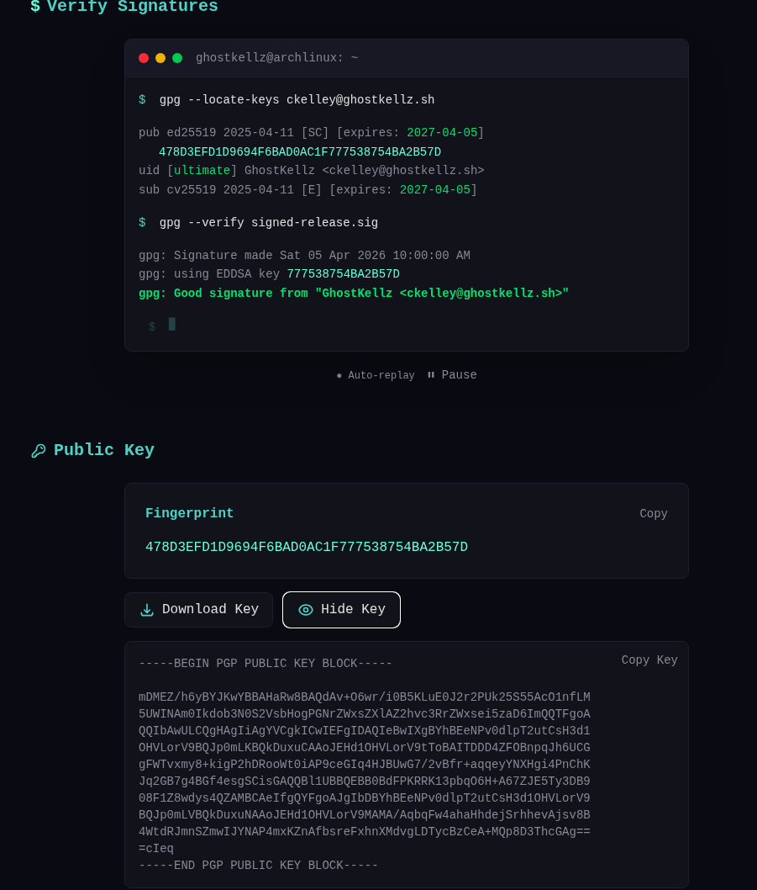

# 👻 GhostKellz Arch Linux Repository 

<p align="center">
  
  
  
  
  
  
  
  
</p>

---

> 🛠️ **About this repository:**
> This is a personal, modular, and actively maintained Arch Linux configuration.
> Tuned for performance, security, and professional daily driver use.

> 📓 **Note:** Treat this as a living **knowledge base** — notes, configs, and diagrams
> from my own time running this setup, not authoritative documentation. Hardware,
> drivers, kernels, and tooling change constantly, so details (version numbers,
> commands, diagram labels) reflect a point in time and may drift.

🌐 This repository uses GPG commit signing with a private WKD-compliant public key.
You can verify signed commits or manually import the GPG public key by visiting ghostkellz.sh.

---

<p align="center">
  
</p>


---
## 📂 Repository Structure

```
arch/
├── CHEATSHEET.md              # General-purpose command and fix reference
├── KROHNKITE.md               # KWin tiling (Krohnkite) workflow notes
├── TMUX.md                    # TMUX configuration reference

├── docs/                      # Centralized guides and cheatsheets
│   ├── GIT-CHEATSHEET.md      # Git basics and daily-use shortcuts
│   ├── NVIM-CHEATSHEET.md     # Neovim keybindings and LSP tips
│   ├── KWIN-CHEATSHEET.md     # KWin window manager shortcuts
│   ├── ZIG-CHEATSHEET.md      # Zig quick reference
│   ├── ZIG_GUIDE.md           # In-depth Zig guide
│   ├── ZIG_ASYNC.md           # Zig async patterns
│   ├── ZIG_DEPENDENCY_GUIDE.md# Zig dependency management
│   └── CI_IMPROVEMENT.md      # CI/CD notes

├── scripts/                   # Modular post-install scripts and automation
├── kb/                        # Troubleshooting knowledge base (Docker, NVIDIA, Zig, kernel)

├── btrfs/                     # Snapper and backup strategies using BTRFS
│   └── snapper/               # Root snapper config and layout

├── dotfiles/                  # Shell and app config files
│   ├── nvim/                  # LazyVim setup with Lua config
│   ├── wezterm/               # WezTerm themes, colors, and config
│   ├── ghostty/               # Ghostty terminal config
│   ├── tmux/                  # TMUX config
│   ├── claude/ · opencode/    # AI assistant configs
│   └── zsh/                   # Modular Zsh configuration (.zshrc.d/, Starship, p10k)

├── rust/                      # Cargo global config + Rust guide/cheatsheet
├── restic/                    # Restic systemd service/timer and env vars
├── nvidia/                    # NVIDIA driver tweaks, fixes, NVENC, gaming/Gamescope
├── networking/                # Network configs (Tailscale, nftables, Unbound DNS)
├── security/                  # Defense-in-depth (FortiGate, DNS, DMZ, CrowdSec)
├── advisories/                # Security advisories: CVE writeups, incidents, IOC scanners
│   ├── cve/                   # CVE writeups and local mitigations
│   ├── incidents/             # Supply-chain / breach reviews
│   └── checks/                # Re-runnable detection scripts

├── system/                    # System-wide tuning (ZRAM, systemd, memory, kernel)
│   ├── kernel/                # Kernel build configs (CachyOS, TKG, NVIDIA)
│   ├── sysctl/ · hooks/       # sysctl tuning and mkinitcpio hooks
│   ├── io.md · memory.md      # I/O scheduler and memory/ZRAM tuning
│   └── power.md · systemd.md  # Power profiles and systemd overrides

├── virtualization/            # QEMU/KVM, Libvirt, PCIe passthrough, Docker
│   └── docker/                # Docker Compose stacks for this workstation

├── kde/                       # KDE Plasma Wayland quirks, bugs, and tuning
├── wayland/                   # Wayland (non-DE) tweaks: env, input, scaling, NVIDIA

│
│   # ── AI / ML stack ──────────────────────────────────────────────
├── ollama/                    # Native Ollama on RTX 5090 (Blackwell, CUDA)
├── hermes/                    # Hermes Agent knowledgebase (install, skills, deploy)
├── openshell/                 # NVIDIA OpenShell sandboxed agent runtimes
│
│   # ── Observability ──────────────────────────────────────────────
├── heimdall-stack/            # Loki + Prometheus + Grafana + Alertmanager + syslog-ng

├── archive/                   # Retired/legacy setups kept for reference
│   └── ghostllm/              # Federated AI mesh (Ollama + LiteLLM + OpenWebUI)

└── assets/                    # Shared images and screenshots for documentation
```

---
## ✅ Key Components

### 🖥️ System & Desktop

- **`docs/`** – Centralized cheatsheets and in-depth guides (Git, Neovim, KWin, Rust, Zig)

- **`scripts/`** – Modular provisioning, setup, and automation scripts

- **`dotfiles/`** – Shell and application configs (Zsh, WezTerm, Ghostty, tmux, Neovim)

  - LazyVim Lua config for Neovim
  - Modular Zsh setup using `.zshrc.d/` with Starship + Powerlevel10k
  - Terminal and AI-assistant (Claude / opencode) configs

- **`btrfs/`** – BTRFS subvolume layouts, Snapper snapshot automation, restore procedures

- **`restic/`** – S3-compatible encrypted backups (MinIO / NAS) with systemd timer and pruning

- **`nvidia/`** – NVIDIA driver fixes, performance tuning, NVENC, Gamescope, and gaming tweaks

- **`system/`** – Core tuning (ZRAM, disk IO, memory, suspend) and kernel builds (CachyOS / TKG)

- **`wayland/`** – Wayland env vars, app compatibility, input, fractional scaling, NVIDIA fixes

- **`kde/`** – KDE Plasma Wayland tweaks and bug workarounds (multi-monitor pageflip, etc.)

- **`kb/`** – Troubleshooting knowledge base (Docker storage, NVIDIA runtime, kernel compat, Zig)

### 🌐 Networking & Security

- **`networking/`** – Tailscale, nftables firewalling, and Unbound recursive DNS

- **`security/`** – Defense-in-depth architecture (FortiGate, DNS, DMZ, CrowdSec threat feeds)

- **`advisories/`** – Security advisories: CVE writeups, supply-chain incident reviews, and re-runnable IOC detection scripts

- **`virtualization/`** – KVM, Libvirt, PCIe passthrough, and Docker Compose stacks

### 🤖 AI / ML Stack

- **`ollama/`** – Native, GPU-accelerated Ollama on the RTX 5090 (Blackwell, CUDA 13.x)

- **`hermes/`** – Hermes Agent knowledgebase: install, skills/memory, MCP, deployment (incl. Proxmox VFIO)

- **`openshell/`** – NVIDIA OpenShell sandboxed, policy-governed runtimes for autonomous agents

### 📊 Observability

- **`heimdall-stack/`** – Logs/metrics/alerts stack: Loki, Prometheus, Grafana, Alertmanager, syslog-ng

  - Ingests FortiGate, Proxmox nodes, CrowdSec, and Wazuh into unified dashboards

### 🗄️ Archive

- **`archive/`** – Retired/legacy setups kept for reference

  - **`ghostllm/`** – Former federated AI mesh (Ollama + LiteLLM + OpenWebUI), superseded by the native Ollama + Hermes setup

- **`assets/`** – Screenshots and visual resources for all documentation

---

### 🔍 Maintained by [Christopher Kelley](https://github.com/ghostkellz)  
### 🔐 GPG Commit Signing

This repository supports verified commits using GPG.

**Author GPG Key:** `ckelley@ghostkellz.sh`

All signed commits from this repository are made using a trusted GPG key and should appear as **Verified** on GitHub.

#### 🔑 Verifying & Importing the Public Key
The public key can be viewed and downloaded at **[ghostkellz.sh](https://ghostkellz.sh)**.

If you want to verify commits or clone the trust for your own use:

```bash
# Import via WKD
gpg --locate-keys ckelley@ghostkellz.sh

# Or import directly from ghostkellz.sh
curl -sL https://ghostkellz.sh/ghostkellz_pubkey.asc | gpg --import
```

**Fingerprint:** `478D3EFD1D9694F6BAD0AC1F777538754BA2B57D`

#### 🔧 Enabling GPG Signing in Git
If you'd like to sign your own commits with GPG:

```bash
gpg --list-keys
# Locate your KEY_ID, then:
git config --global user.signingkey <KEY_ID>
git config --global commit.gpgsign true
```
---

### 🖥️ CK-Arch System Overview

A look at the setup powering this repository:

<p align="center">
  
</p>

[](nvidia/nvidia.conf)

---

## 🌐 Join the GhostForge Community

> **GhostForge** is our growing community for Linux users, gamers, IT professionals, and programmers.
>  
> Connect, collaborate, share projects, and vibe with others who believe in the future of open source + tech freedom.
>  
> **🌎 Join us today at [discord.ghostkellz.sh](https://discord.ghostkellz.sh) → Discord invite awaits!**

---


---
### 🔐 GPG Key Visual

The trusted GPG key used to sign commits for this repository (covering both `ckelley@ghostkellz.sh` and `chris@cktechx.com`):

<p align="center">
  
</p>

It can also be viewed and downloaded directly at [ghostkellz.sh](https://ghostkellz.sh):

<p align="center">
  
</p>

---
<p align="center"><b>Feel free to fork or submit pull requests!</b></p>
