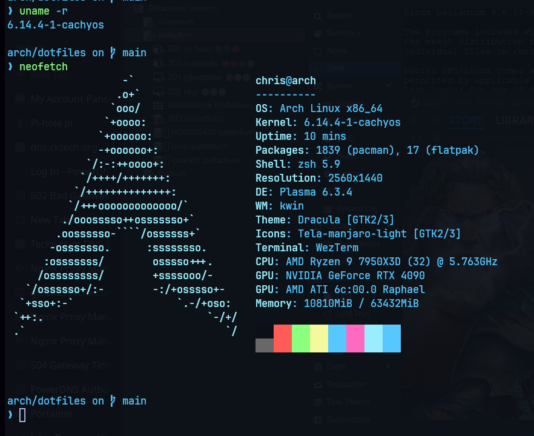
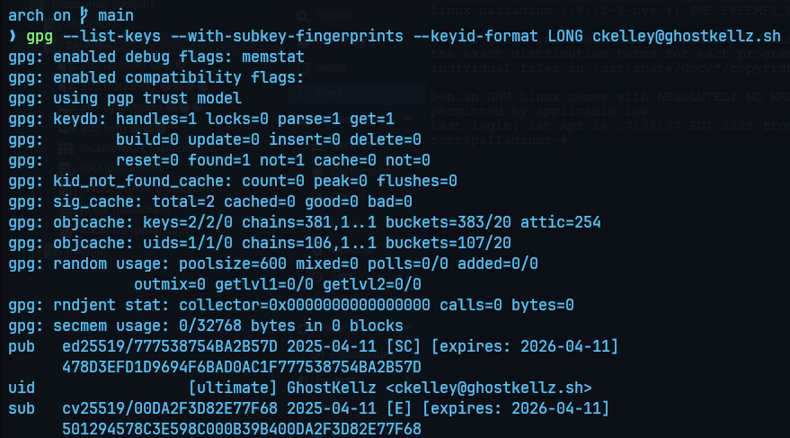

# 👻 GhostKellz Arch Linux Repository 👻

<p align="center">
   &nbsp;&nbsp;
   &nbsp;&nbsp;
   &nbsp;&nbsp;
   &nbsp;&nbsp;
   &nbsp;&nbsp;
  
  
   &nbsp;&nbsp;
</p>

---

> 🛠️ **About this repository:**  
> This is a personal, modular, and actively maintained Arch Linux configuration.  
> Tuned for performance, security, and professional daily driver use.

🌐 This repository uses GPG commit signing with a private WKD-compliant public key.
You can verify signed commits or manually import the GPG public key by visiting ghostkellz.sh.

---

<p align="center">
  
</p>


---
## 📂 Repository Structure

```
arch/
├── cheatsheet.md              # General-purpose command and fix reference
├── git-cheatsheet.md          # Basic Git usage tips
├── nvim-cheatsheet.md         # Neovim configuration and plugin commands
├── zsh-cheatsheet.md          # Zsh basics, plugins, and shortcuts

├── scripts/                   # Modular post-install script for configuring system packages

├── btrfs/                     # Snapper and backup strategies using BTRFS
│   └── snapper/               # Root snapper config and layout

├── dotfiles/                  # Shell and app config files
│   ├── nvim/                  # LazyVim setup with Lua config
│   ├── wezterm/               # WezTerm themes, colors, and config
│   ├── zsh/                   # Modular Zsh configuration
│   │   ├── .zshrc             # Main Zsh config (Starship + NVIDIA + loader)
│   │   ├── starship.toml      # Starship prompt theming
│   │   ├── bootstrap.sh       # Zsh bootstrap script (symlinks, plugin setup, etc.)
│   │   ├── .zshrc.d/          # Modular aliases and functions
│   │   │   ├── docker.zsh
│   │   │   ├── git-aliases.zsh
│   │   │   ├── restic.zsh
│   │   │   ├── snapper.zsh
│   │   │   ├── system.zsh
│   │   │   └── wezterm.zsh
│   └── oh-my-zsh/             # Custom plugins/themes (not full Oh My Zsh install)
│       └── custom/
│           ├── plugins/
│           │   ├── zsh-autosuggestions/
│           │   └── zsh-syntax-highlighting/
│           └── themes/
│               └── your-theme.zsh-theme
├── .bashrc                    # Bash configuration (fallback)

├── restic/                    # Restic systemd service/timer and env vars
├── nvidia/                    # NVIDIA-specific tweaks and fixes
├── networking/                # Network configs (Headscale, Tailnet, NGINX, etc.)
├── system/                    # System-wide tuning (ZRAM, systemd, memory, kernel)
│   ├── kernel/                # Kernel tweaks and boot configuration
│   │   ├── tkg/               # Custom bootloader entry and customization.cfg
│   │   └── kernel-params.md   # Boot parameter summary
│   ├── io.md                  # I/O scheduler tweaks and disk settings
│   ├── memory.md              # ZRAM, swappiness, and caching behavior
│   ├── power.md               # Power profiles, suspend tuning
│   └── systemd.md             # Systemd timers, journal, and overrides

├── virtualization/            # QEMU, passthrough, and Libvirt tuning
│   ├── kvm.md
│   ├── libvirt.md
│   ├── passthrough.md
│   ├── tweaks.md
│   └── docker/                # Docker Compose stacks that live on this workstation
├── kde/                       # KDE-specific quirks, bugs, and tuning (Wayland-specific)
│   ├── README.md              # KDE + Wayland + NVIDIA freeze fix (pageflip)
│   └── known_issues.md        # Known issues tracking (Wayland pageflip bug, etc.)

├── wayland/                   # Wayland (non-DE specific) tweaks and guides
│   ├── tweaks.md              # Global Wayland environment variables
│   ├── compatibility.md       # App compatibility: Discord, OBS, Firefox, etc.
│   ├── input.md               # libinput, gestures, touchpads
│   ├── fractional-scaling.md  # Multi-monitor DPI, scaling fixes
│   └── nvidia.md              # NVIDIA + Wayland driver and rendering tweaks

└── assets/                    # Shared images and screenshots for documentation
```

---
## ✅ Key Components

- **`cheatsheet.md`** – Common commands, tips, and troubleshooting notes for Arch Linux systems

- **`git-cheatsheet.md`** – Git basics, branch management, and daily use shortcuts

- **`nvim-cheatsheet.md`** – Neovim keybindings, plugin manager (LazyVim), and LSP tips

- **`zsh-cheatsheet.md`** – Zsh shell shortcuts, plugin usage, and shell script tips

- **`scripts/`** – Modular `ckel.sh` script for provisioning, setup, and automation

  - Automates: package installs, system services, dotfile linking, Tailnet setup, Restic backup prep, and networking tweaks

- **`dotfiles/`** – Shell and application configs (Zsh, WezTerm, Neovim)

  - LazyVim Lua config for Neovim
  - Modular Zsh setup using `.zshrc.d/`
  - Starship prompt and custom Oh My Zsh plugin + theme framework

- **`restic/`** – S3-compatible encrypted backup system (MinIO / Synology NAS)

  - Includes: systemd timer, service, environment config, automated pruning

- **`btrfs/`** – BTRFS subvolume layouts, Snapper snapshot automation, systemd-boot integration

- **`nvidia/`** – NVIDIA OpenDKMS fixes and performance tuning

  - Gamescope tweaks, modprobe parameters, GSP firmware handling

- **`system/`** – Core system tuning (ZRAM, disk IO, memory, suspend behavior)

  - Kernel customizations (Cachy/BORE/EEVDF)
  - ZRAM with zstd, I/O scheduler tuning, swap management

- **`wayland/`** – Wayland-specific tweaks (global env vars, app compatibility, NVIDIA fixes)

  - Covers KDE, GNOME, Hyprland environments

- **`kde/`** – KDE Plasma Wayland tweaks and bug workarounds

  - Solves multi-monitor pageflip timeout bugs

- **`networking/`** – Advanced home + cloud networking (Headscale, WireGuard SD-WAN, NGINX proxying)

  - Split DNS setups, secure remote access, multi-WAN routing

- **`virtualization/`** – KVM, Libvirt, PCIe passthrough optimizations for workstation VMs

- **`docker/`** – LXC/Docker AI Services and Automation Hub

  - Includes: OpenWebUI frontend, Ollama backend, NGINX proxy stacks
  - Additional Compose files at [GhostKellz Docker Repo](https://github.com/ghostkellz/docker)

- **`assets/`** – Screenshots and visual resources for all documentation

---

### 🔍 Maintained by [Christopher Kelley](https://github.com/ghostkellz)  
### 🔐 GPG Commit Signing

This repository supports verified commits using GPG.

**Author GPG Key:** `ckelley@ghostkellz.sh`

All signed commits from this repository are made using a trusted GPG key and should appear as **Verified** on GitHub.

#### 🔑 Verifying & Importing the Public Key
If you want to verify commits or clone the trust for your own use:

```bash
gpg --locate-keys ckelley@ghostkellz.sh
```

#### 🔧 Enabling GPG Signing in Git
If you'd like to sign your own commits with GPG:

```bash
gpg --list-keys
# Locate your KEY_ID, then:
git config --global user.signingkey <KEY_ID>
git config --global commit.gpgsign true
```
---

### 🖥️ CK-Arch System Overview

A look at the setup powering this repository:

<p align="center">
  
</p>


---

## 🌐 Join the GhostForge Community

[](https://ghostkellz.gg)

> **GhostForge** is our growing community for Linux users, gamers, IT professionals, and programmers.
>  
> Connect, collaborate, share projects, and vibe with others who believe in the future of open source + tech freedom.
>  
> **🌎 Join us today at [GhostKellz.gg](https://ghostkellz.gg) → Discord invite awaits!**

---


---
### 🔐 GPG Key Visual

Here is a visual confirmation of the GPG key used to sign commits for this repository:

<p align="center">
  
</p>

---
<p align="center"><b>Feel free to fork or submit pull requests!</b></p>
