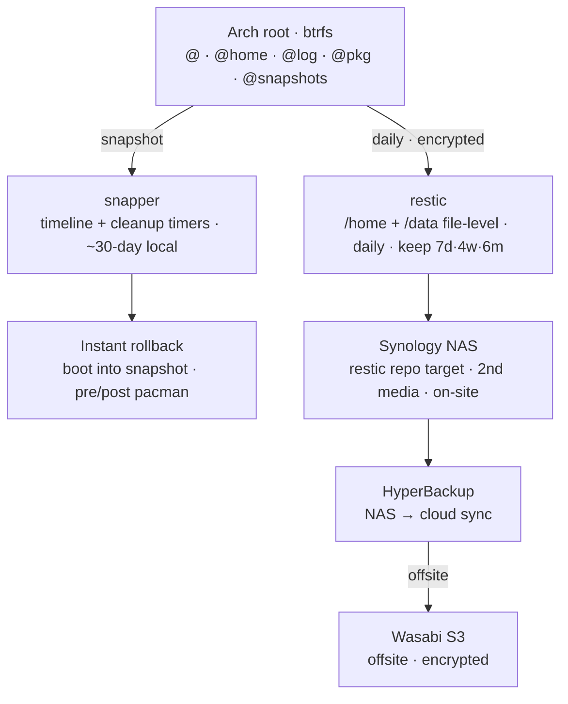

# 🌐 BTRFS Backup Strategy 🔥👻 | GhostKellz

[](https://archlinux.org) [](https://btrfs.readthedocs.io) [](https://www.synology.com/) [](https://restic.net/) [](https://min.io/) [](https://azure.microsoft.com)

---

# 🔄 Overview
This guide outlines a **hybrid local + remote backup** strategy for Arch Linux systems using:
- **BTRFS snapshots** (with Snapper)
- **Synology NAS** storage (via NFS share)
- **Optional encrypted backups** (with Restic)
- **MinIO** object storage (optional cloud backup)
- **Azure** cloud integration (future expansion)

Designed for resilience, rollback capability, and automation.

---

# 🗺️ Backup Tiers

A layered 3-2-1 strategy: instant local rollback up front, encrypted file-level
backups to second media, and an encrypted offsite copy in the cloud.



> **snapper** = instant local rollback · **restic** = encrypted file-level offsite.
> The two layers are independent: a bad upgrade is a snapshot boot away, while a
> drive/host loss is covered by restic → NAS → cloud.

---

# 📸 Step 1: Take Snapshots with Snapper
Use Snapper to automate snapshot creation.

### Enable Snapshot Timers
```bash
sudo systemctl enable --now snapper-timeline.timer
sudo systemctl enable --now snapper-cleanup.timer
```

### Optional: Auto-snapshot on `pacman` changes
```bash
yay -S snap-pac
```

---

# 📃 Step 2: Mount Synology NAS Share (Preferred via NFS)

### On Synology:
1. Enable **NFS** service.
2. Create a shared folder (e.g., `linux-backups`).
3. Allow access to your Arch machine's IP in NFS permissions.

### On Arch:
```bash
sudo pacman -S nfs-utils
sudo mkdir -p /mnt/nas
sudo mount -t nfs 192.168.x.x:/volume1/linux-backups /mnt/nas
```

Optional: Add permanent mount to `/etc/fstab`:
```bash
192.168.x.x:/volume1/linux-backups /mnt/nas nfs defaults,noatime,x-systemd.automount 0 0
```

---

# 🔄 Step 3: Sync Snapshots to NAS

### 🔗 Option 1: `btrfs send` + `btrfs receive`
```bash
sudo btrfs send //.snapshots/XX/snapshot | ssh user@nas 'btrfs receive /volume1/linux-backups/snapshots'
```
- Fastest method
- Requires BTRFS support on NAS

### 📁 Option 2: `rsync` (Recommended)
```bash
sudo rsync -aAXv /.snapshots /mnt/nas/arch-snapshots --delete
```
- More compatible (works with EXT4, BTRFS, etc.)
- Easier automation with `cron` or systemd timers

---

# 🔐 Option 3: Encrypted Deduplicated Backup with `restic`

### Install Restic
```bash
sudo pacman -S restic
```

### Initialize Repository
```bash
restic init --repo /mnt/nas/restic-arch
```

### Backup Important Directories
```bash
restic -r /mnt/nas/restic-arch backup / --exclude={"/mnt","/proc","/sys","/dev","/run"}
```

**Tip:** Store password in `/etc/restic/restic.env` or secure environment variables.

---

# 👀 Best Practices
- ✨ Use **Snapper** for rollback/versioning.
- ✨ Use **rsync** or **restic** to back up to your Synology NAS.
- ✨ Use **MinIO** or **Azure** for advanced cloud-based backups.
- ⏰ Schedule backups via **systemd timers** or `cron` for automation.

---

# 🔹 Related
- See [`snapper.md`](snapper.md) for more detailed snapshot configuration.

> 📢 **This BTRFS backup strategy is proudly maintained and battle-tested by GhostKellz!**
