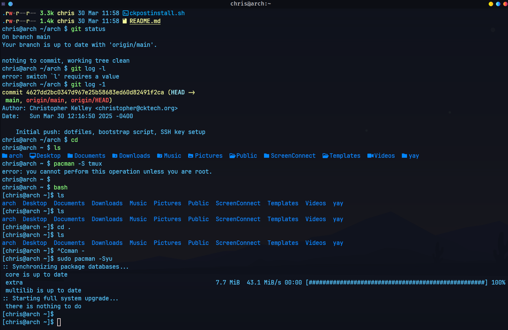

# 👻🖥️ GhostKellz Terminal 2.0

A performance-focused, minimalist WezTerm setup with a hacker-blue aesthetic and GPU acceleration. Designed for modern Arch-based environments running Wayland + NVIDIA.

---

## 🎨 Theme Overview

- **Color Scheme**: `ghostkellz` (based on TokyoNight with custom tweaks)
- **Foreground**: `#57c7ff` (light hacker blue)
- **Background**: `#0d1117` (deep navy)
- **Cursor/Selection**: Clean neon blue with soft highlight contrast

---

## 🧠 Features

- ⚙️ WebGPU rendering with OpenGL fallback
- 🧠 JetBrainsMono + FiraCode Nerd Fonts
- 💡 Custom ANSI and bright palettes
- 🖱️ KDE/Wayland compatible with cursor hack
- 📋 Keybindings for splits, clipboard, debug overlay
- 🌀 Smooth blinking block cursor
- 🧬 Starship prompt + zsh integration

---

## 🗂️ Directory Structure

```
dotfiles/wezterm/
├── assets/
│   ├── wezterm-PreviewPic.png     # Terminal appearance screenshot
│   └── nvim-preview.png           # Optional: Nvim inside WezTerm
├── colors/
│   └── ghostkellz.toml            # Custom ghostkellz color scheme
├── wezterm.lua                    # Main config
```

---

## 📸 Previews

### WezTerm Appearance


### Neovim Inside WezTerm


---

## 💬 Notes

GhostKellz is built for performance, style, and minimalism.  
It’s meant to blend aesthetics with practical daily-driver performance for power users.

Wayland/NVIDIA is fully supported.

---

👻 Made by [GhostKellz](https://github.com/ghostkellz)

