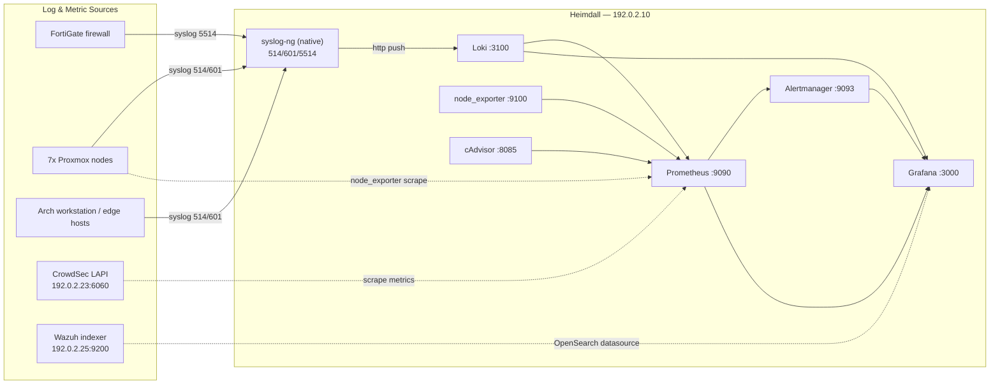

# Heimdall — Observability & Log Aggregation Stack

Heimdall is a dedicated observability/SIEM-adjacent server that aggregates **logs**
(syslog-ng → Loki), **metrics** (Prometheus + exporters), **alerts** (Alertmanager),
and presents everything through **Grafana** — including read-only views into the
existing **CrowdSec** and **Wazuh** deployments.

- **Host:** `heimdall` — `192.0.2.10` (LAN), `100.64.0.10` (Tailscale), Ubuntu 26.04, user `youruser`
- **Model:** author config in this repo (source of truth) → deploy to `/opt/heimdall` on the host
- **Runtime:** Docker Compose (host networking) for the core stack; **syslog-ng runs natively** on the host (privileged `:514`)

---

## Architecture at a glance



See **[docs/architecture.md](docs/architecture.md)** for detailed data-flow diagrams.

---

## Port map

| Service        | Port            | Bind / scope            | Notes                                    |
|----------------|-----------------|-------------------------|------------------------------------------|
| Grafana        | `3000/tcp`      | LAN + tailnet           | UI / dashboards                          |
| Prometheus     | `9090/tcp`      | LAN + tailnet           | metrics + alerting                       |
| Alertmanager   | `9093/tcp`      | LAN + tailnet           | alert routing                            |
| Loki           | `3100/tcp`      | loopback (push/query)   | gRPC on `9096`                           |
| node_exporter  | `9100/tcp`      | loopback (scraped)      | host metrics                             |
| cAdvisor       | `8085/tcp`      | loopback (scraped)      | container metrics                        |
| syslog-ng      | `514/udp+tcp`   | LAN                     | RFC3164 standard syslog                  |
| syslog-ng      | `601/tcp`       | LAN                     | RFC5424 (IETF)                           |
| syslog-ng      | `5514/udp+tcp`  | LAN                     | FortiGate dedicated                      |
| syslog-ng      | `6514/tcp`      | (scaffolded, disabled)  | RFC5425 TLS                              |

External (observed, not hosted here): CrowdSec LAPI `192.0.2.23:6060`, Wazuh indexer `192.0.2.25:9200`.

---

## Repository layout

```
heimdall-stack/
├── docker-compose.yml          # core stack: loki, prometheus, alertmanager, grafana, node-exporter, cadvisor
├── .env.example                # copy to .env on host; secrets + image pins
├── alertmanager/               # alertmanager.yml (routing stub)
├── loki/                       # loki-config.yml (single-binary, 30d retention)
├── prometheus/
│   ├── prometheus.yml          # scrape jobs (file-SD for nodes/proxmox)
│   ├── alerts/infra.yml        # alert rules
│   └── targets/                # file-SD targets (hot-reload, no restart)
├── grafana/
│   ├── provisioning/           # datasources + dashboard provider
│   └── dashboards/             # 7 dashboards (overview, host, containers, logs, firewall, security)
├── syslog-ng/conf.d/           # native syslog-ng pipeline (sources → Loki + on-disk archive)
├── scripts/setup-ufw.sh        # host firewall
├── docker/scripts/             # deploy.sh, test-syslog.sh
└── docs/                       # documentation (you are here)
```

---

## Quick start

```bash
# 1. On the workstation: configure secrets
cp .env.example .env
$EDITOR .env                      # set Grafana pw, Wazuh creds, confirm image pins

# 2. Deploy the core stack to Heimdall (rsync + compose up)
./docker/scripts/deploy.sh

# 3. Install the native syslog-ng pipeline on the host (one-time)
#    see docs/deployment.md → "syslog-ng pipeline"

# 4. Lock down the host firewall
ssh youruser@192.0.2.10 'sudo bash /opt/heimdall/scripts/setup-ufw.sh'

# 5. Verify
./docker/scripts/test-syslog.sh 192.0.2.10      # send test syslog → Loki
# open Grafana: http://192.0.2.10:3000
```

Full step-by-step in **[docs/deployment.md](docs/deployment.md)**.

---

## Documentation index

| Doc | Purpose |
|-----|---------|
| [docs/architecture.md](docs/architecture.md)   | Components, data-flow diagrams, design decisions |
| [docs/deployment.md](docs/deployment.md)        | Author→deploy workflow, first-run, verification |
| [docs/operations.md](docs/operations.md)        | Day-2 ops: reload, logs, backup, troubleshooting |
| [docs/networking.md](docs/networking.md)        | Ports, firewall, Tailscale, network segments |
| [docs/dashboards.md](docs/dashboards.md)        | Dashboard catalog + provisioning |
| [docs/senders/fortigate.md](docs/senders/fortigate.md)     | Onboard FortiGate syslog |
| [docs/senders/proxmox.md](docs/senders/proxmox.md)         | Onboard Proxmox (syslog + node_exporter) |
| [docs/senders/linux-syslog.md](docs/senders/linux-syslog.md) | Onboard generic Linux syslog senders |
| [docs/senders/crowdsec.md](docs/senders/crowdsec.md)       | Enable CrowdSec Prometheus metrics |
| [docs/senders/wazuh.md](docs/senders/wazuh.md)             | Wire Grafana to the Wazuh indexer |
