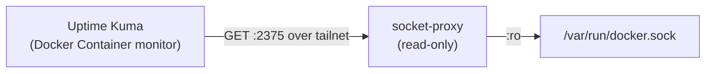

# Docker socket proxy (read-only)

A hardened, **GET-only** proxy in front of `/var/run/docker.sock`. Uptime Kuma's
*Docker Container* monitor and cAdvisor read container state through it without ever
getting read-write access to the real Docker socket. Deploy one per Docker host you
want container health for.

> Runs on the **Docker host**, not on Heimdall. Heimdall/Uptime Kuma are the clients.



---

## Setup (on each Docker host)

The compose file alone is **not enough** — the bind address is the part that bites.

```bash
# 1. Stage the stack (example path)
mkdir -p ~/socket-proxy && cd ~/socket-proxy
# copy docker-compose.yml and .env.example from this directory

# 2. Bind to THIS host's Tailscale IP (the critical second step)
cp .env.example .env
$EDITOR .env            # SOCKET_PROXY_BIND_IP=<this host's tailnet IP>

# 3. Start / recreate
docker compose up -d

# 4. Host firewall: allow 2375 ONLY over the tailnet
sudo ufw allow in on tailscale0 to any port 2375 proto tcp
#   nftables equivalent (adjust iface/CIDR to your tailnet or PVE SDN):
#   nft add rule inet filter input iifname "tailscale0" tcp dport 2375 accept
#   PVE SDN: allow TCP 2375 from the trusted Tailscale/SDN source only.
```

**Why the bind matters:** the default `127.0.0.1:2375:2375` makes the proxy reachable
only from the Docker host itself, so a remote Uptime Kuma cannot connect. Binding to
the host's Tailscale IP makes it reachable over the tailnet and nowhere else.

---

## Verify (from another host on the tailnet)

```bash
IP=100.64.0.40   # the Docker host's tailnet IP

curl -i http://$IP:2375/_ping                              # 200 OK
curl -i http://$IP:2375/version                            # 200 OK
curl -i http://$IP:2375/containers/json                    # 200 OK
curl -i -X POST http://$IP:2375/containers/nonexistent/stop # 403 Forbidden
```

The `403` on the write attempt confirms the proxy is read-only.

---

## Add to Uptime Kuma

In the monitor (or **Settings → Docker Hosts**):

- **Connection Type:** `TCP / HTTP`
- **Docker Daemon:** `http://100.64.0.40:2375`
- **No trailing space** in the Docker Daemon field.

> Trailing-space gotcha: a stray space makes Uptime Kuma request `%20/containers/json`,
> which the proxy answers with `400 Bad request`. If a previously-working Docker host
> monitor suddenly returns 400, check for a trailing space first.

See [docs/senders/uptime-kuma.md](../docs/senders/uptime-kuma.md) for the monitor types.
