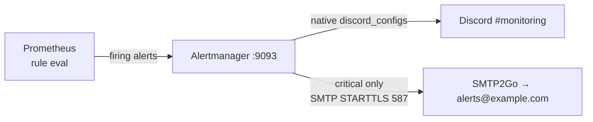

# Alerting: Alertmanager → Discord + SMTP2Go

Prometheus evaluates the rules in `prometheus/alerts/` and pushes firing alerts to
Alertmanager (`127.0.0.1:9093`), which routes them to **Discord** (all severities) and
**SMTP2Go email** (critical only).



| Severity | Receiver | Channel |
|----------|----------|---------|
| `warning` and below | `monitoring-discord` | Discord `#monitoring` |
| `critical` | `monitoring-discord-email` | Discord `#monitoring` + email |

---

## 1. Secrets (file-based, never inlined)

Alertmanager reads its secrets from files mounted read-only at
`/etc/alertmanager/secrets`. The host directory `secrets/alertmanager/` is gitignored.

```bash
mkdir -p secrets/alertmanager
cp alertmanager/secrets.example/smtp-auth-password     secrets/alertmanager/
cp alertmanager/secrets.example/discord-monitoring-url secrets/alertmanager/
$EDITOR secrets/alertmanager/smtp-auth-password         # SMTP2Go SMTP password
$EDITOR secrets/alertmanager/discord-monitoring-url     # Discord #monitoring webhook URL
chmod 600 secrets/alertmanager/*
```

`docker-compose.yml` mounts it:

```yaml
volumes:
  - ./secrets/alertmanager:/etc/alertmanager/secrets:ro
```

and `alertmanager.yml` references the files:

```yaml
global:
  smtp_auth_password_file: /etc/alertmanager/secrets/smtp-auth-password
receivers:
  - name: monitoring-discord
    discord_configs:
      - webhook_url_file: /etc/alertmanager/secrets/discord-monitoring-url
```

---

## 2. Use native `discord_configs` — not the Slack-compat endpoint

Alertmanager has had a native `discord_configs` receiver since v0.25. **Use it.**

Routing Alertmanager through Discord's Slack-compatible webhook
(`.../slack` with `slack_configs`) **fails**: Discord rejects Alertmanager's Slack
attachment payload with `HTTP 400`. A raw `curl` to the `/slack` endpoint can succeed
in a quick smoke test, which is misleading — the attachment shape Alertmanager actually
sends is what Discord refuses. Native `discord_configs` posts a plain JSON message and
works.

---

## 3. SMTP2Go

```yaml
global:
  smtp_smarthost: mail.smtp2go.com:587
  smtp_from: alertmanager@example.com
  smtp_auth_username: alertmanager@example.com
  smtp_auth_password_file: /etc/alertmanager/secrets/smtp-auth-password
  smtp_require_tls: true
```

`587` is STARTTLS. SMTP2Go also offers `2525`, `8025`, `25` (STARTTLS) and
`465`, `8465`, `443` (implicit TLS) if `587` is blocked upstream.

---

## 4. Validate before enabling noisy routes

```bash
# config + mounted secrets parse cleanly (run inside the container so the
# /etc/alertmanager/secrets/* files resolve)
docker compose exec alertmanager amtool check-config /etc/alertmanager/alertmanager.yml

# hot-reload after editing alertmanager.yml
curl -X POST http://127.0.0.1:9093/-/reload
```

Fire a synthetic alert straight at Alertmanager to confirm delivery end-to-end:

```bash
# warning -> Discord only
curl -s -XPOST http://127.0.0.1:9093/api/v2/alerts -H 'Content-Type: application/json' -d '[{
  "labels":{"alertname":"NotifyTest","severity":"warning","instance":"heimdall"},
  "annotations":{"summary":"warning notification test"}}]'

# critical -> Discord + email
curl -s -XPOST http://127.0.0.1:9093/api/v2/alerts -H 'Content-Type: application/json' -d '[{
  "labels":{"alertname":"NotifyTest","severity":"critical","instance":"heimdall"},
  "annotations":{"summary":"critical notification test"}}]'
```

Both clear automatically (no `endsAt`, short-lived). Confirm the message lands in
Discord and, for critical, in the `alerts@example.com` inbox.

---

## 5. Noise control

- Grouping (`group_by`, `group_wait`, `group_interval`) and `repeat_interval: 4h` keep
  flapping targets from spamming Discord.
- The `inhibit_rules` block suppresses the `warning` for an instance when a `critical`
  for the same `alertname`+`instance` is already firing.
- After enabling Alertmanager, pre-existing `TargetDown` conditions fire immediately.
  Fix the underlying targets (see
  [runbooks/syslog-ng-loki-recovery.md](runbooks/syslog-ng-loki-recovery.md) and the
  sender docs) rather than muting the rule.
