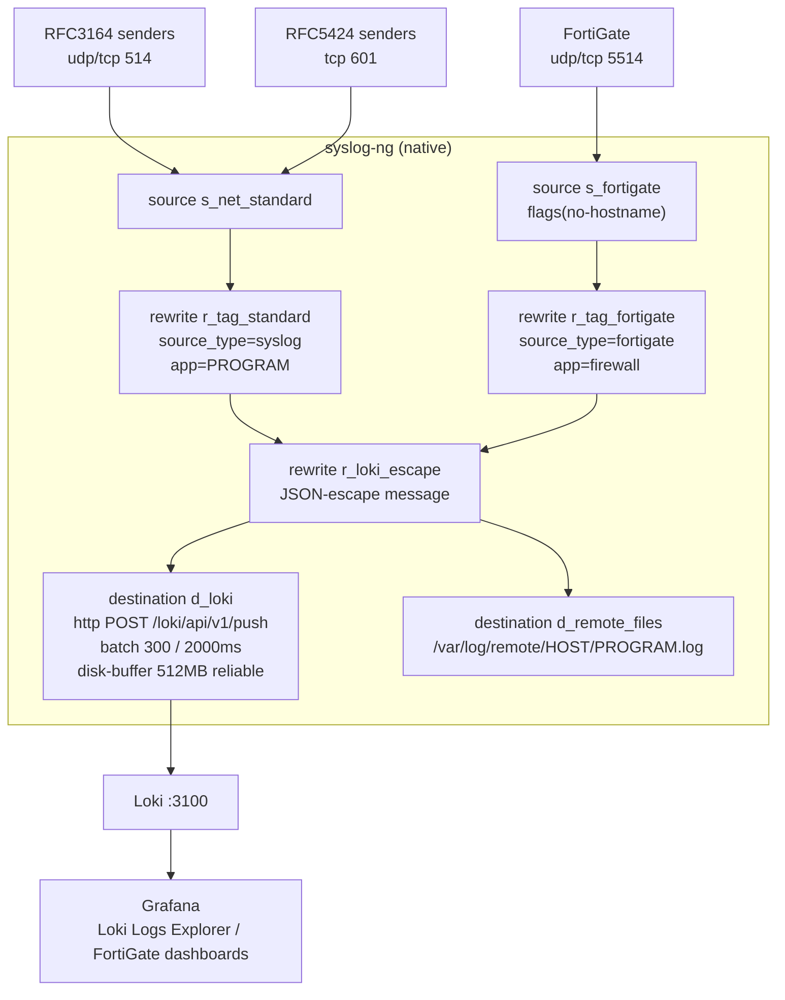
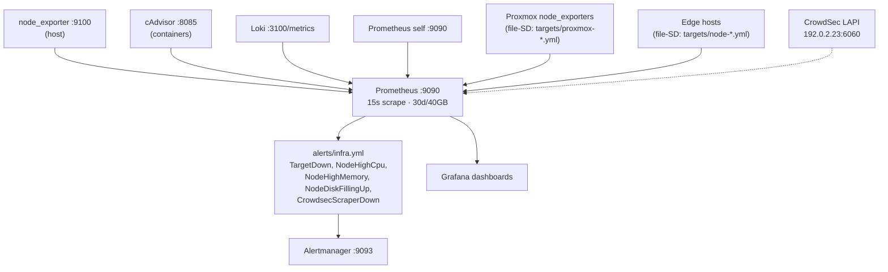
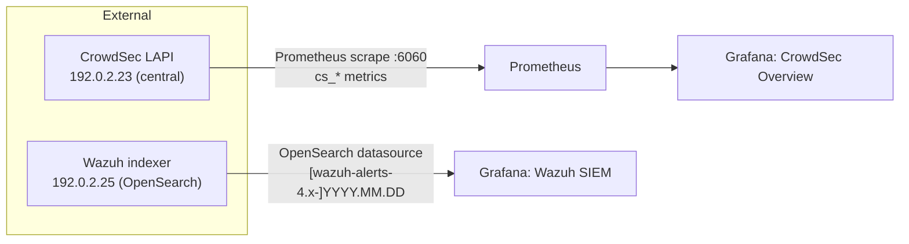
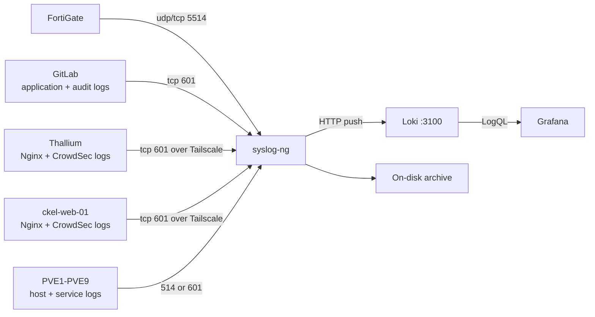
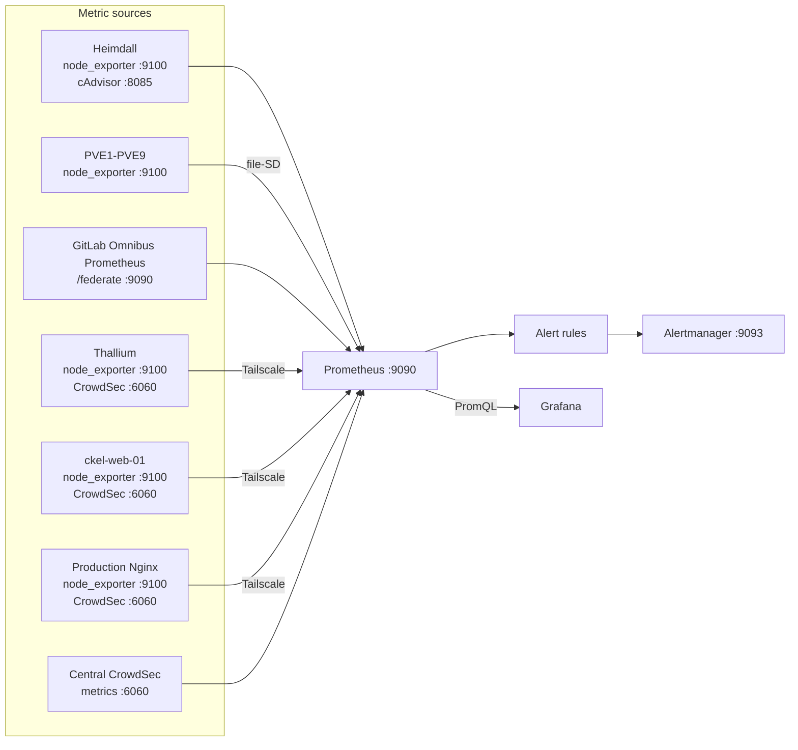
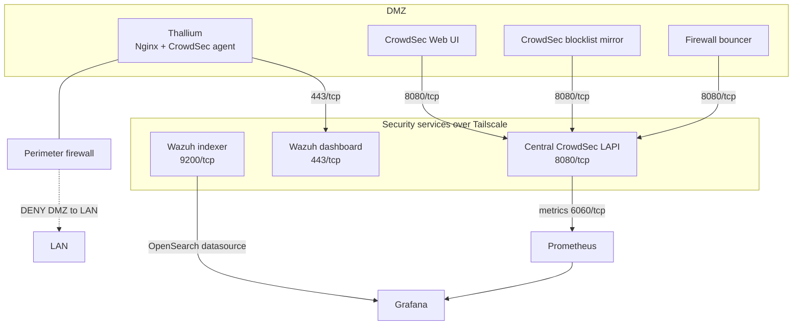
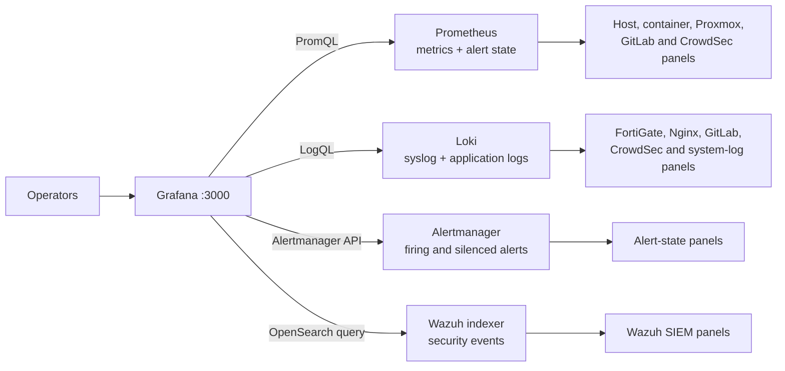
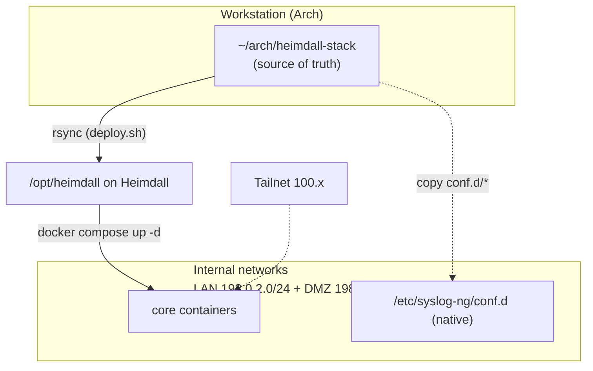

# Architecture

Heimdall is a single-node observability server. It runs two independent pipelines —
**logs** and **metrics** — and a visualization layer (Grafana) that also reaches out
to two external security systems (CrowdSec, Wazuh) read-only.

- **Logs:** `syslog senders → syslog-ng (native) → Loki → Grafana`
- **Metrics:** `exporters → Prometheus → (Alertmanager + Grafana)`
- **Security overlays:** `CrowdSec metrics → Prometheus`, `Wazuh indexer → Grafana`

---

## Component responsibilities

| Component      | Runs as            | Role |
|----------------|--------------------|------|
| **syslog-ng**  | native host service | Receives syslog (514/601/5514), tags streams, pushes to Loki, archives to disk |
| **Loki**       | container           | Log store; 30-day retention, TSDB v13, filesystem backend |
| **Prometheus** | container           | Metrics scrape + storage (30d/40GB), rule evaluation |
| **Alertmanager** | container         | Receives firing alerts from Prometheus; routing (stub today) |
| **node_exporter** | container        | Host-level metrics (CPU, mem, disk, net) |
| **cAdvisor**   | container           | Per-container metrics |
| **Grafana**    | container           | Dashboards over Loki + Prometheus + Alertmanager + Wazuh |

All containers use `network_mode: host`. State lives in named Docker volumes
(`loki-data`, `prometheus-data`, `alertmanager-data`, `grafana-data`) plus the host
paths `/var/log/remote` (syslog archive) and `/var/lib/syslog-ng` (Loki disk-buffer).

---

## Log pipeline (syslog-ng → Loki)



**Stream labels** are deliberately low-cardinality to keep Loki healthy:
`host`, `facility`, `severity`, `source_type`, `app`.

- FortiGate payloads are `key=value` with no RFC3164 hostname → a dedicated port
  (`5514`) + `flags(no-hostname)` keeps the sender IP as `host` and the full blob in
  the message. Query-time parsing uses LogQL `| logfmt`.
- The on-disk archive (`/var/log/remote/<host>/<program>.log`) is a redundant copy,
  independent of Loki.
- Timestamps use **reception time** (ns); Loki 3 accepts unordered writes within a
  stream, so per-sender clock skew does not reject lines.

> **Why http() not the native loki() driver?** The syslog-ng 4.8.1 build on Heimdall
> ships the `http` + `json` modules but **not** the gRPC `loki()` driver, so the
> pipeline pushes JSON to Loki's HTTP push API directly.

---

## Metrics pipeline (exporters → Prometheus)



**File-based service discovery** lets you add Proxmox nodes and edge hosts by editing
`prometheus/targets/*.yml` and reloading — no Prometheus restart:

```bash
curl -X POST http://127.0.0.1:9090/-/reload
```

---

## Security overlays



**Observe-only by design.** Heimdall does not run CrowdSec or Wazuh components; it
reads their existing endpoints. CrowdSec stays central on `192.0.2.23` (LAPI + DB);
Heimdall just scrapes its Prometheus endpoint. Wazuh alerts are queried straight from
the indexer via the `grafana-opensearch-datasource` plugin.

---

## Reference deployment: log fan-in

The public template supports a larger deployment without embedding private addresses.
GitLab, public web servers, the DMZ reverse proxy, and the Proxmox fleet all converge
on the same native syslog-ng pipeline:



---

## Reference deployment: metrics fan-in

Prometheus scrapes infrastructure exporters directly or through Tailscale-only socket
proxies. File-based service discovery keeps the host inventory outside the main scrape
configuration.



---

## Reference deployment: security services

The perimeter firewall denies direct DMZ-to-LAN traffic from Thallium. Its CrowdSec
and Wazuh web-proxy connections use destination-specific Tailscale grants instead.



The UI can exclude bulk CAPI/community-blocklist records from its local display cache
without changing the decisions enforced by CrowdSec bouncers or the blocklist mirror.

---

## How Grafana assembles dashboards

Grafana is the visualization layer, not the collector or primary telemetry store. Each
panel queries its corresponding provisioned datasource:



---

## Network & deployment topology



The repo is authored on the workstation and pushed to `/opt/heimdall`. The core stack
runs in Docker there; the syslog-ng pipeline is copied into the host's
`/etc/syslog-ng/conf.d/` and runs natively (it needs privileged port 514 and should
not depend on the Docker daemon being up to keep receiving logs).

---

## Design decisions

| Decision | Rationale |
|----------|-----------|
| syslog-ng native, rest in Docker | Privileged `:514`, and log ingest must survive Docker restarts |
| `http()` push to Loki | The installed syslog-ng build lacks the gRPC `loki()` driver |
| Low-cardinality Loki labels | Avoid stream explosion; parse details at query time (`logfmt`) |
| Host networking | Workstation standard; avoids bridge DNS/connectivity issues |
| CrowdSec/Wazuh observe-only | Keep single sources of truth; no duplicate agents/DBs on Heimdall |
| File-SD for Prometheus targets | Add nodes without restarts; targets are versioned config |
| Image pins via `.env` | Reproducible builds; deliberate, reviewable version bumps |

See **[docs/senders/wazuh.md](senders/wazuh.md)** for the OpenSearch index-pattern
detail (the plugin needs a date-math pattern, not a literal `*`).
