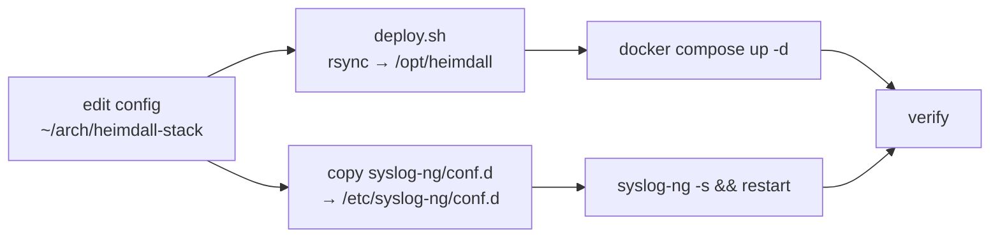

# Deployment

The repository is the **source of truth**. You author config on the workstation and
deploy to Heimdall (`192.0.2.10`, user `youruser`) at `/opt/heimdall`. The core stack
runs in Docker there; syslog-ng runs natively on the host.



---

## Prerequisites (on Heimdall)

Confirmed present during build; verify if rebuilding:

- Ubuntu 26.04, Docker ≥ 29, Docker Compose v2
- syslog-ng 4.8.1 with `http` + `json` modules (`syslog-ng --version | grep -i http`)
- `youruser` in the `docker` group
- `/opt/heimdall` exists and is writable by `youruser`
- Adequate disk for `prometheus-data` (40GB cap) + `loki-data` (30d) + `/var/log/remote`

---

## 1. Configure secrets

```bash
cd ~/arch/heimdall-stack
cp .env.example .env
$EDITOR .env
```

Set at minimum:

| Variable | Value |
|----------|-------|
| `GF_SECURITY_ADMIN_PASSWORD` | strong Grafana admin password |
| `GF_SERVER_ROOT_URL` | `http://192.0.2.10:3000` (or tailnet URL) |
| `WAZUH_INDEXER_URL` | `https://192.0.2.25:9200` (blank = skip Wazuh datasource) |
| `WAZUH_INDEXER_USER` / `WAZUH_INDEXER_PASSWORD` | Wazuh indexer creds |

Image versions are pinned in `.env` (override the older compose defaults). `.env` is
gitignored — never commit it.

---

## 2. Deploy the core stack

```bash
./docker/scripts/deploy.sh
```

This `rsync`s the repo to `/opt/heimdall` (excluding `.git`, `.env`, `secrets/`) and
runs `docker compose up -d`, then prints `docker compose ps`.

> `deploy.sh` uses `rsync --delete`. The host `.env` is excluded from sync, so it is
> **not** wiped — but anything else under `/opt/heimdall` not in the repo will be
> removed. Keep host-only files out of `/opt/heimdall`.

Expected: `loki`, `prometheus`, `alertmanager`, `grafana`, `node-exporter`, `cadvisor`
all `Up` (Loki/Prometheus report `healthy`).

---

## 3. Install the syslog-ng pipeline (native, one-time)

The pipeline lives in `syslog-ng/conf.d/`. Copy the active configs to the host and
validate before restart:

```bash
HOST=youruser@192.0.2.10
# copy active configs (skip the .disabled TLS scaffold)
rsync -az syslog-ng/conf.d/10-network-sources.conf \
          syslog-ng/conf.d/20-fortigate.conf \
          syslog-ng/conf.d/90-loki.conf \
          "$HOST:/tmp/sng/"
ssh "$HOST" 'sudo install -m0644 /tmp/sng/*.conf /etc/syslog-ng/conf.d/ && \
             sudo syslog-ng -s && \
             sudo systemctl restart syslog-ng && \
             systemctl is-active syslog-ng'
```

`syslog-ng -s` validates the config; **never restart without it** (a bad config drops
all logging). Existing file-based logging on the host is preserved.

---

## 4. Host firewall

```bash
ssh youruser@192.0.2.10 'sudo bash /opt/heimdall/scripts/setup-ufw.sh'
```

Opens syslog ingest (514/601/5514) and admin UIs (3000/9090/9093) to the LAN segments,
always keeps SSH + Tailscale open (no lockout), default-deny otherwise. See
[networking.md](networking.md).

---

## 5. Verify (end-to-end)

```bash
# containers healthy
ssh youruser@192.0.2.10 'cd /opt/heimdall && docker compose ps'

# listeners present
ssh youruser@192.0.2.10 'ss -tulpn | grep -E ":(3000|9090|9093|3100|9100|8085|514|601|5514)"'

# Prometheus targets all up
ssh youruser@192.0.2.10 'curl -s http://127.0.0.1:9090/api/v1/targets | \
    jq -r ".data.activeTargets[] | .labels.job + \" \" + .health"'

# syslog → Loki round-trip
./docker/scripts/test-syslog.sh 192.0.2.10
ssh youruser@192.0.2.10 'curl -sG http://127.0.0.1:3100/loki/api/v1/query_range \
    --data-urlencode "query={source_type=\"syslog\"}" --data-urlencode "limit=5" | jq ".data.result | length"'
```

Then open Grafana at `http://192.0.2.10:3000`, log in, and confirm the **Heimdall**
folder shows all dashboards with data. For datasource health checks see
[operations.md](operations.md).

---

## Updating

- **Config change:** edit in repo → `./docker/scripts/deploy.sh` (compose reconciles).
- **Prometheus targets/alerts only:** edit `prometheus/targets|alerts/`, deploy, then
  `curl -X POST http://127.0.0.1:9090/-/reload` (no restart).
- **Image bump:** change the pin in `.env`, redeploy; `docker compose pull` if needed.
- **Dashboard change:** edit JSON in `grafana/dashboards/`, deploy; the provider
  reloads every 30s (no restart).
- **syslog-ng change:** re-copy conf.d, `syslog-ng -s`, restart.

## Rollback

- Core stack: `docker compose down` (add `-v` to wipe volumes/state).
- syslog-ng: restore the previous `/etc/syslog-ng/conf.d/*.conf`, `syslog-ng -s`, restart.
- All persistent state is in named Docker volumes + `/opt/heimdall` + `/var/log/remote`.
