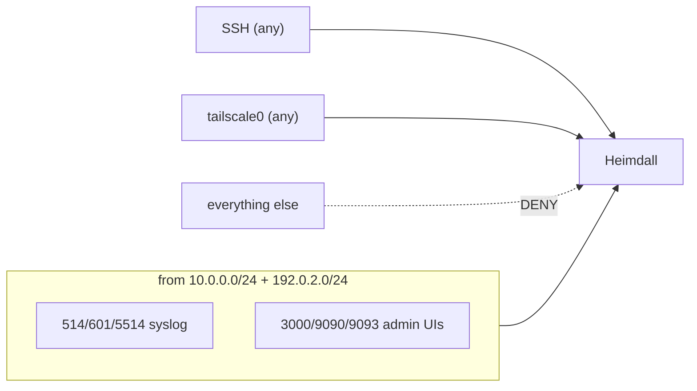

# Networking

## Segments

| Name | CIDR | Hosts |
|------|------|-------|
| LAN1 | `10.0.0.0/24` | FortiGate, Proxmox, workstation, CrowdSec (`.23`), Wazuh (`.25`), Heimdall (`.28`) |
| LAN2 | `192.0.2.0/24` | edge hosts (e.g. Reverse-proxy `.7`) |
| Tailnet | `100.x` | Heimdall `100.64.0.10`, Wazuh `100.64.0.25` |

---

## Listening ports (Heimdall)

| Port | Proto | Service | Exposure |
|------|-------|---------|----------|
| 3000 | tcp | Grafana | LAN + tailnet |
| 9090 | tcp | Prometheus | LAN + tailnet |
| 9093 | tcp | Alertmanager | LAN + tailnet |
| 3100 | tcp | Loki HTTP | loopback (push/query/scrape) |
| 9096 | tcp | Loki gRPC | loopback |
| 9100 | tcp | node_exporter | loopback (scraped) |
| 8085 | tcp | cAdvisor | loopback (scraped) |
| 514  | udp+tcp | syslog-ng RFC3164 | LAN |
| 601  | tcp | syslog-ng RFC5424 | LAN |
| 5514 | udp+tcp | syslog-ng FortiGate | LAN |
| 6514 | tcp | syslog-ng RFC5425 TLS | scaffolded, disabled |

Outbound from Heimdall: CrowdSec metrics `192.0.2.23:6060`, Wazuh indexer
`192.0.2.25:9200`, Proxmox/edge node_exporters `:9100`.

---

## Firewall (UFW)

`scripts/setup-ufw.sh` (run on the host) sets default-deny inbound and allows:



- SSH and `tailscale0` are allowed **before** `ufw enable` — no lockout.
- Idempotent: UFW dedups identical rules, so re-running is safe.
- Loki/node_exporter/cAdvisor are loopback-only and intentionally not opened.

---

## Tailscale

Heimdall joins the tailnet so the stack is reachable off-LAN and so future cloud hosts
can talk to it over WireGuard:

```bash
sudo tailscale up --hostname heimdall --ssh
```

To expose admin UIs over the tailnet, set `GF_SERVER_ROOT_URL` to the tailnet address
and rely on the `allow in on tailscale0` UFW rule (already present).

---

## TLS syslog (future)

`syslog-ng/conf.d/99-tls-listener.conf.disabled` scaffolds an RFC5425 TLS listener on
`6514`. To enable: generate certs under `/etc/syslog-ng/certs/`, drop the `.disabled`
suffix, `syslog-ng -s`, restart, and open `6514/tcp` in UFW.
