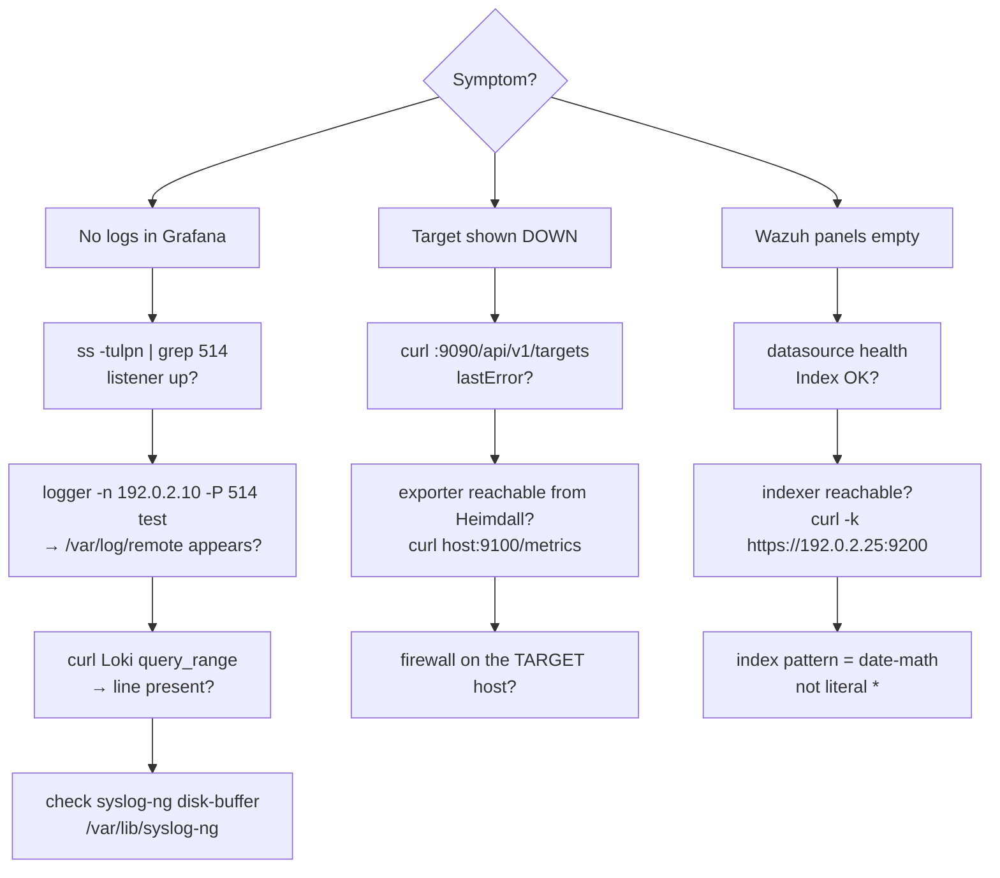

# Operations (Day-2)

Routine operation, inspection, and troubleshooting. All commands run on Heimdall
(`youruser@192.0.2.10`) unless noted; the core stack lives in `/opt/heimdall`.

---

## Service control

```bash
cd /opt/heimdall
docker compose ps                      # status
docker compose logs -f grafana         # tail one service
docker compose restart prometheus      # restart one service
docker compose up -d                   # reconcile to compose/.env
docker compose down                    # stop all (keeps volumes)

# syslog-ng (native)
systemctl status syslog-ng
sudo syslog-ng -s                      # validate config (always before restart)
sudo systemctl restart syslog-ng
```

---

## Hot-reload without restart

| Change | Command |
|--------|---------|
| Prometheus targets/alerts | `curl -X POST http://127.0.0.1:9090/-/reload` |
| Alertmanager config (routing/receivers, see [alerting.md](alerting.md)) | `curl -X POST http://127.0.0.1:9093/-/reload` |
| Grafana dashboards | none — provider reloads every 30s |
| Grafana datasources | recreate container: `docker compose up -d --force-recreate grafana` |

---

## Health & verification

```bash
# Prometheus targets and their health
curl -s http://127.0.0.1:9090/api/v1/targets \
  | jq -r '.data.activeTargets[] | "\(.labels.job)\t\(.health)\t\(.scrapeUrl)"'

# Loki ready + label/series sanity
curl -s http://127.0.0.1:3100/ready
curl -sG http://127.0.0.1:3100/loki/api/v1/labels | jq .data

# Grafana datasource health (needs admin pw)
GADM=$(grep '^GF_SECURITY_ADMIN_PASSWORD' /opt/heimdall/.env | cut -d= -f2-)
for u in prometheus loki alertmanager wazuh; do
  printf '%s: ' "$u"
  curl -s -u "admin:$GADM" "http://localhost:3000/api/datasources/uid/$u/health" \
    | jq -r '"\(.status) - \(.message)"'
done
```

Healthy Wazuh output: `OK - Index OK. Time field name OK.`

---

## Inspecting logs in Loki

```bash
# what source_types are present
curl -sG http://127.0.0.1:3100/loki/api/v1/label/source_type/values | jq .data

# recent FortiGate lines
curl -sG http://127.0.0.1:3100/loki/api/v1/query_range \
  --data-urlencode 'query={source_type="fortigate"}' \
  --data-urlencode 'limit=10' | jq -r '.data.result[].values[][1]'
```

On-disk archive (independent of Loki): `/var/log/remote/<host>/<program>.log`.

---

## Backup & restore

Persistent state:

| Data | Location |
|------|----------|
| Grafana DB (users, prefs) | volume `grafana-data` |
| Prometheus TSDB | volume `prometheus-data` |
| Loki chunks/index | volume `loki-data` |
| Alertmanager silences | volume `alertmanager-data` |
| Syslog archive | host `/var/log/remote` |
| syslog-ng disk-buffer | host `/var/lib/syslog-ng` |

Dashboards, datasources, alerts, and pipeline config are **all in this repo** — the
authoritative copy. Grafana dashboards are provisioned read-only, so the repo is the
restore source for them.

```bash
# Snapshot a volume to a tarball
docker run --rm -v grafana-data:/data -v "$PWD":/backup alpine \
  tar czf /backup/grafana-data.tgz -C /data .
```

---

## Troubleshooting



**No logs reaching Loki**
1. Listener up? `ss -tulpn | grep -E ':(514|601|5514)'`
2. syslog-ng healthy? `systemctl status syslog-ng`, `sudo syslog-ng -s`
3. Disk-buffer backing up (Loki down)? check `/var/lib/syslog-ng` size + `docker compose ps loki`
4. Sender actually pointed at `192.0.2.10` and allowed by the host firewall?

> Loki panels empty but the on-disk archive still growing? That's a stuck syslog-ng
> disk-buffer, not a dead sender — see
> [runbooks/syslog-ng-loki-recovery.md](runbooks/syslog-ng-loki-recovery.md).

**A Prometheus target is DOWN**
1. `curl -s :9090/api/v1/targets | jq '.data.activeTargets[]|select(.health!="up")|{job:.labels.job,err:.lastError}'`
2. Reach the exporter from Heimdall: `curl -s http://<target>:9100/metrics | head`
3. Usually a firewall on the **target** host, not Heimdall.

**Wazuh SIEM panels empty**
1. Datasource health (above). If `Index not found`, the index pattern must be a
   date-math pattern (`[wazuh-alerts-4.x-]YYYY.MM.DD` + `interval: Daily`), not `*`.
   See [senders/wazuh.md](senders/wazuh.md).
2. Indexer reachable? `curl -sk -u admin:*** https://192.0.2.25:9200/_cat/indices/wazuh-alerts-*`
3. Time range — the dashboard defaults to `now-24h`; widen if alerts are sparse.

**cAdvisor dashboard sparse**
- Known caveat: cAdvisor here emits only the cgroup `id` label, not `name`/`image`, so
  community panels keyed on `name` under-populate. The overview "Containers seen" panel
  works around this with `container_last_seen{id=~"/system.slice/docker-.*"}`.
