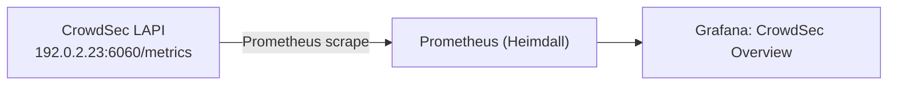

# Onboarding: CrowdSec metrics (observe-only)

CrowdSec stays **central** on `192.0.2.23` (LAPI + database). Heimdall does **not** run
CrowdSec or a duplicate DB — it only scrapes the LAPI's Prometheus endpoint and renders
the **CrowdSec Overview** dashboard.



---

## Enable the Prometheus endpoint on 192.0.2.23

CrowdSec exposes metrics only if its Prometheus listener binds an address Heimdall can
reach. In `/etc/crowdsec/config.yaml` on `192.0.2.23`:

```yaml
prometheus:
  enabled: true
  level: full
  listen_addr: 0.0.0.0   # was 127.0.0.1 — must be reachable from Heimdall
  listen_port: 6060
```

```bash
sudo systemctl restart crowdsec
# confirm it is listening off-loopback
ss -tulpn | grep 6060
```

Restrict `6060` to Heimdall on the CrowdSec host's firewall (only `192.0.2.10` needs it).

---

## Heimdall side (already configured)

`prometheus/prometheus.yml` already scrapes it:

```yaml
- job_name: crowdsec
  static_configs:
    - targets: ["192.0.2.23:6060"]
      labels: { host: crowdsec-lapi, instance: "192.0.2.23" }
```

The alert rule `CrowdsecScraperDown` fires if the endpoint is unreachable for 5m.

---

## Verify

```bash
# from Heimdall: endpoint reachable + emitting cs_* metrics?
curl -s http://192.0.2.23:6060/metrics | grep -c '^cs_'

# Prometheus shows the target up?
curl -s http://127.0.0.1:9090/api/v1/targets \
  | jq -r '.data.activeTargets[] | select(.labels.job=="crowdsec") | .health'
```

Key metrics used by the dashboard: `cs_active_decisions{action,origin,reason}`,
`cs_alerts{reason}`, `cs_lapi_route_requests_total`, `cs_lapi_bouncer_requests_total`,
`cs_papi_last_pull_timestamp`.

---

## Optional: ship CrowdSec/bouncer logs too

For log-level correlation, point the CrowdSec host's rsyslog at Heimdall as in
[linux-syslog.md](linux-syslog.md). The metrics integration above is independent of
this and sufficient for the dashboard.
