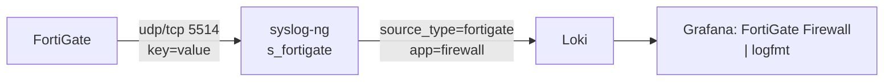

# Onboarding: FortiGate firewall

FortiGate emits `key=value` syslog with a PRI header but **no** RFC3164 hostname/tag,
which breaks default syslog parsing. Heimdall gives it a dedicated port (`5514`) with
`flags(no-hostname)` so the sender IP becomes the `host` label and the full blob stays
intact in the message for query-time `logfmt` parsing.



---

## Configure the FortiGate

CLI (`config log syslogd setting`):

```
config log syslogd setting
    set status enable
    set server "192.0.2.10"
    set port 5514
    set mode udp          # or "reliable" for TCP delivery
    set format default    # key=value (do NOT use cef/csv)
    set facility local7
end
```

GUI: **Log & Report → Log Settings → Syslog** → server `192.0.2.10`, port `5514`.

Pick what to log under **Log & Report** policies (traffic, UTM, event). Use `reliable`
(TCP) if you need delivery guarantees; UDP is lower overhead.

---

## Heimdall side (already configured)

- Source: `syslog-ng/conf.d/20-fortigate.conf` — `s_fortigate` on udp/tcp `5514`.
- Firewall: `setup-ufw.sh` already opens `5514/udp` + `5514/tcp` from the LAN segments.
- Stream labels applied: `source_type=fortigate`, `app=firewall`, plus `host` (sender IP).

Nothing to change on Heimdall unless the firewall isn't on the LAN segments in
`scripts/setup-ufw.sh`.

---

## Verify

```bash
# from Heimdall: are FortiGate lines arriving?
curl -sG http://127.0.0.1:3100/loki/api/v1/query_range \
  --data-urlencode 'query={source_type="fortigate"}' \
  --data-urlencode 'limit=5' | jq -r '.data.result[].values[][1]'

# on-disk archive
sudo ls -l /var/log/remote/<fortigate-ip>/
```

Then open the **FortiGate Firewall** dashboard. LogQL examples (query-time parse):

```logql
# events by action
sum by (action) (count_over_time({source_type="fortigate"} | logfmt [$__interval]))

# top source IPs
topk(10, sum by (srcip) (count_over_time({source_type="fortigate"} | logfmt [$__range])))
```

---

## Troubleshooting

- **No data:** confirm `set port 5514` (not the default 514) and `set format default`.
  CEF/CSV formats won't `logfmt`-parse.
- **`host` shows an IP not a name:** expected — FortiGate sends no hostname; the sender
  IP is used. Map it to a friendly name in dashboards if desired.
- **Lines present but fields missing in panels:** the FortiGate isn't sending those
  keys for that event type; check the raw line in the log stream panel.
