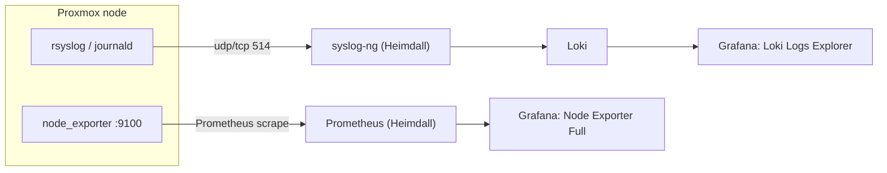

# Onboarding: Proxmox nodes

Each Proxmox (PVE) node contributes two signals to Heimdall:

1. **Metrics** — `node_exporter` scraped by Prometheus (file-SD, no restart).
2. **Logs** — system syslog forwarded to syslog-ng → Loki.



---

## 1. Metrics — install node_exporter

On each PVE node (Debian-based):

```bash
# option A: distro package
sudo apt-get update && sudo apt-get install -y prometheus-node-exporter

# option B: upstream binary (pin to the version in .env)
VER=v1.9.1
curl -fsSL "https://github.com/prometheus/node_exporter/releases/download/${VER}/node_exporter-${VER#v}.linux-amd64.tar.gz" \
  | sudo tar xz -C /usr/local/bin --strip-components=1 --wildcards '*/node_exporter'
# create a systemd unit that runs: node_exporter --web.listen-address=:9100
sudo systemctl enable --now node_exporter
```

Allow Heimdall to scrape `:9100` (open it to `192.0.2.10` on the node's firewall, or
restrict node_exporter to the management interface).

### Register the target on Heimdall

Edit `prometheus/targets/proxmox-nodes.yml` in this repo:

```yaml
- targets:
    - "192.0.2.11:9100"   # pve1
    - "192.0.2.12:9100"   # pve2
  labels:
    role: hypervisor
    cluster: proxmox
```

Deploy and hot-reload (no Prometheus restart):

```bash
./docker/scripts/deploy.sh
ssh youruser@192.0.2.10 'curl -X POST http://127.0.0.1:9090/-/reload'
```

Confirm the `proxmox-node` job targets are `up` in Prometheus, then view **Node
Exporter Full**.

---

## 2. Logs — forward syslog to Heimdall

On each PVE node with rsyslog, drop in `/etc/rsyslog.d/60-heimdall.conf`:

```
# forward everything to Heimdall syslog-ng (RFC3164 over TCP 514)
*.*  @@192.0.2.10:514
# (use a single @ for UDP; @@ is TCP)
```

Reload: `sudo systemctl restart rsyslog`.

For journald-only nodes, enable `ForwardToSyslog=yes` in
`/etc/systemd/journald.conf` (with rsyslog) or use `systemd-journal-upload`.

### Verify

```bash
# from Heimdall
curl -sG http://127.0.0.1:3100/loki/api/v1/query_range \
  --data-urlencode 'query={host="pve1"}' --data-urlencode 'limit=5' | jq '.data.result|length'
```

These arrive as `source_type=syslog`, `app=<program>`, `host=<node>`, filterable in the
**Loki Logs Explorer**.

---

## Notes

- Metrics and logs are independent — you can onboard one without the other.
- The `node` job also accepts edge/workstation targets via
  `prometheus/targets/node-*.yml` (label `role: host`).
- Firewall reachability problems are almost always on the **PVE node** side, not
  Heimdall — test with `curl http://<node>:9100/metrics` from Heimdall.
