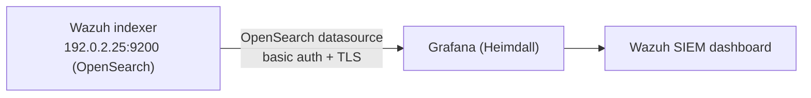

# Onboarding: Wazuh indexer (Grafana OpenSearch datasource)

Heimdall reads the **existing** Wazuh deployment's indexer directly — no Wazuh agents,
manager, or duplicate storage on Heimdall. Grafana queries `wazuh-alerts-*` via the
`grafana-opensearch-datasource` plugin and renders the **Wazuh SIEM** dashboard.



- Indexer: `192.0.2.25:9200` (LAN), `100.64.0.25:9200` (tailnet), user `admin`
- Reports as OpenSearch (ES-compat version `7.10.2`), daily indices
  `wazuh-alerts-4.x-YYYY.MM.DD`
- Time field: `timestamp` (the alert time; `@timestamp` is ingest time — both are `date`)

---

## 1. Expose the indexer (if loopback-bound)

Wazuh indexer often binds `127.0.0.1` only. To let Heimdall reach it, set
`network.host` in `/etc/wazuh-indexer/opensearch.yml` on `192.0.2.25`:

```yaml
network.host: "0.0.0.0"
```

> **Caution — back up first and change ONE line.** Binding off-loopback flips
> OpenSearch from dev to **production** mode and activates bootstrap checks
> (`vm.max_map_count >= 262144`, discovery config). Leave `discovery`/
> `cluster.initial_master_nodes` exactly as-is.
>
> ```bash
> sudo cp /etc/wazuh-indexer/opensearch.yml /etc/wazuh-indexer/opensearch.yml.bak-$(date +%s)
> # edit ONLY network.host, then:
> sudo systemctl restart wazuh-indexer
> # verify cluster recovers green:
> curl -sk -u admin:*** https://127.0.0.1:9200/_cluster/health | jq .status
> ```
>
> A YAML mistake here will stop the indexer (Wazuh goes down). If restart fails,
> restore the backup and retry with a minimal edit.

Internal consumers (filebeat, wazuh-modulesd, the dashboard) use `127.0.0.1:9200` and
are unaffected by binding to `0.0.0.0`. Restrict `:9200` to Heimdall at the firewall
once verified.

---

## 2. Configure Grafana (already provisioned)

Set in `.env` on Heimdall:

```ini
WAZUH_INDEXER_URL=https://192.0.2.25:9200
WAZUH_INDEXER_USER=admin
WAZUH_INDEXER_PASSWORD=<indexer password>
```

`grafana/provisioning/datasources/datasources.yml` provisions the datasource:

```yaml
- name: Wazuh
  uid: wazuh
  type: grafana-opensearch-datasource
  url: ${WAZUH_INDEXER_URL}
  basicAuth: true
  basicAuthUser: ${WAZUH_INDEXER_USER}
  secureJsonData:
    basicAuthPassword: ${WAZUH_INDEXER_PASSWORD}
  jsonData:
    database: "[wazuh-alerts-4.x-]YYYY.MM.DD"   # date-math pattern, NOT "wazuh-alerts-*"
    interval: Daily
    flavor: opensearch
    version: "2.0.0"
    timeField: "timestamp"
    tlsSkipVerify: true
```

Apply: `docker compose up -d --force-recreate grafana`.

---

## The index-pattern gotcha (important)

The `grafana-opensearch-datasource` plugin does **not** expand a literal `*`. A
`database` of `wazuh-alerts-*` makes the datasource health check fail with:

```
ERROR - Index not found: wazuh-alerts-*
```

…even though the indices exist and the indexer is reachable. The plugin needs a
**date-math pattern + interval**, which it expands against the query time range:

| `database` | result |
|------------|--------|
| `wazuh-alerts-*` (literal `*`) | ❌ Index not found |
| `wazuh-alerts-4.x-2026.06.11` (concrete) | ✅ Index OK |
| `[wazuh-alerts-4.x-]YYYY.MM.DD` + `interval: Daily` | ✅ Index OK |

Wazuh writes one index per day (`wazuh-alerts-4.x-YYYY.MM.DD`), so the daily date-math
pattern is correct.

---

## Verify

```bash
# datasource health (expect: OK - Index OK. Time field name OK.)
GADM=$(grep '^GF_SECURITY_ADMIN_PASSWORD' /opt/heimdall/.env | cut -d= -f2-)
curl -s -u "admin:$GADM" http://localhost:3000/api/datasources/uid/wazuh/health \
  | jq -r '"\(.status) - \(.message)"'

# indexer reachable + indices present
curl -sk -u admin:*** https://192.0.2.25:9200/_cluster/health | jq .status
curl -sk -u admin:*** 'https://192.0.2.25:9200/_cat/indices/wazuh-alerts-*?h=index' | wc -l
```

Then open **Wazuh SIEM**. Panels use the OpenSearch query model — a Lucene `query`
string plus `metrics` (count/cardinality) and `bucketAggs` (date_histogram/terms on
`rule.level`, `rule.description`, `agent.name`, `rule.mitre.technique`, `data.srcip`).

---

## Troubleshooting

- **`Index not found`** → you're using `*`; switch to the date-math pattern above.
- **`time field name is required`** → `timeField` missing from `jsonData`.
- **Auth/TLS errors** → check `WAZUH_*` in `.env`; `tlsSkipVerify: true` is set because
  the indexer uses a self-signed cert.
- **Empty panels but health OK** → widen the dashboard time range; default is `now-24h`.
