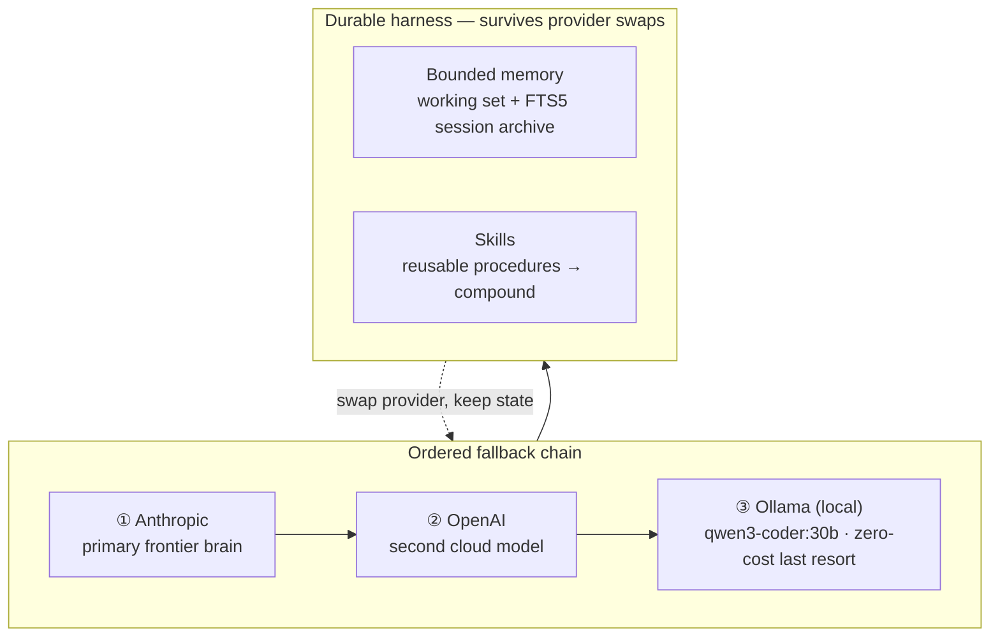
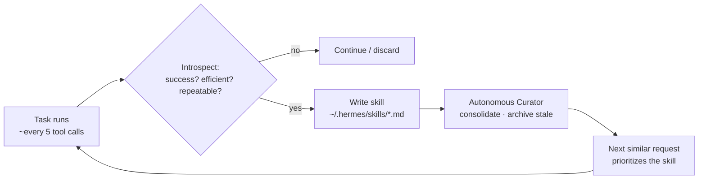

# Overview — What Hermes Agent Actually Is

Hermes Agent is an open-source autonomous AI system from **Nous Research** that
runs on your own machine, a VPS, a GPU box, or serverless infra. The thing that
separates it from a stateless chat UI: it **persists across sessions and learns**,
automatically writing reusable procedures from experience.

MIT licensed. Built by the lab behind the Hermes, Nomos, and Psyche models.

## Harness Engineering

The core design belief: the *wrapper* around the model — instructions,
constraints, feedback, memory, orchestration — matters more than the model
itself. Because the harness carries the value, you can swap the underlying model
(frontier API, local, or whatever's next) without rebuilding your setup. This is
why `hermes model` can repoint at a new provider with no code changes.

> Memory + skills live **outside** the model — switch providers without losing state.
> The local Ollama tier (the native `ollama-cuda` on the 5090, see
> [`../ollama/README.md`](../ollama/README.md)) is a zero-cost last resort when cloud
> providers are unavailable.

## The learning loop

This is the differentiator. After a task completes (or roughly every ~5 tool
calls) the agent introspects:

- Did execution succeed?
- Were there inefficiencies?
- Is this repeatable?

When the answer is yes, it writes a markdown **skill** file to `~/.hermes/skills/`.
Later, similar requests prioritize that skill, so execution gets faster and more
reliable the more you use it. Capability compounds over weeks of use.

## Memory architecture

Memory is intentionally **bounded** to force consolidation discipline and prevent
context bloat:

| Layer | Approx. capacity | Purpose |
|-------|------------------|---------|
| `MEMORY.md` | ~2,200 chars | Active working context |
| `USER.md` | ~1,375 chars | User facts / preferences |
| Session DB (FTS5) | Unlimited | Full-text-searchable conversation archive |

These live under `~/.hermes/memories/` and `~/.hermes/state.db` (created on first
session). For unlimited semantic memory, community providers integrate as plugins
(Honcho, Mem0, Hindsight, Supermemory).

## Skills system

Skills are **executable procedures, not metadata**. Where other systems store a
fact like "prefers bullet points," Hermes stores a reusable workflow that directly
executes — trigger description, steps, tool sequence, required context, I/O
examples.

- **Generated** on repetition detection (5+ similar tool calls) or when a user
  correction teaches a generalizable pattern.
- **Patched** in place when found outdated, incomplete, or wrong.
- An **Autonomous Curator** reviews agent-created skills, consolidates overlap,
  and archives stale entries.
- **Trust tiers:** Builtin → Official → Trusted → Community.

## Interfaces (gateways)

Two entry points:

1. **Terminal** — `hermes` (classic CLI) or `hermes --tui` (modern TUI).
2. **Gateway** — run the broker and talk to the same agent from Telegram,
   Discord, Slack, WhatsApp, Signal, Email, Home Assistant, Teams, etc.

For multi-user/team use, **profile isolation** gives each profile its own memory,
sessions, skills, and cron state, with allowlist-based access control.

## Where it fits next to other tools

- **Claude Code** — in-repo coding specialist (reads/edits files, runs tests, commits).
- **Cursor** — IDE inline pair programmer.
- **Hermes** — cross-repo research, automation, scheduling, multi-channel
  coordination, with persistent memory + skills.

Common power-user pattern: **Hermes alongside Claude Code** — Hermes does research
/ automation / scheduling, Claude Code does the in-repo editing.

## Safety model

Destructive operations (file deletion, force-push, recursive removal) require
explicit confirmation. Sessions are logged to `~/.hermes/sessions/` and most
operations are reversible. Optional Docker terminal backend provides sandbox
enforcement.

## See also

- [skills-and-memory.md](skills-and-memory.md) — deeper on skills + Curator
- [models-and-providers.md](models-and-providers.md) — model selection + the 64k context floor
- [getting-started.md](getting-started.md) — first run
