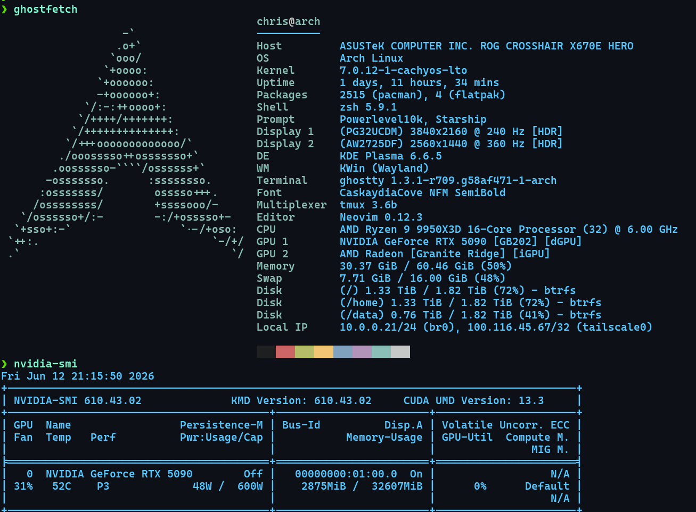

# 👻  KDE + Wayland GhostKellz Setup

   

---

## ❄️ Frozen Screen Bug (Pageflip Timeout)

- **Symptom:** One monitor freezes or entire desktop becomes unresponsive under KDE Wayland.
- **Cause:** `Pageflip timed out! This is a bug in the nvidia-drm kernel driver` (see journal logs).
- **Temporary Fix:**
  - Switch to a TTY: `Ctrl + Alt + F3` (or F2/F4)
  - Return to graphical session: `Ctrl + Alt + F1`
  - This refreshes the compositor without rebooting or killing session. Or also logging off and logging back in.

**Current status:** this has not reproduced under standard usage with the
current NVIDIA Open source-DKMS module and CachyOS-LTO kernel. Treat any future
recurrence as a new incident and capture the exact kernel, driver, KWin, and
connector state rather than assuming the historical cause.

## 🪛 System Info

## 🎮 Current NVIDIA RTX 5090 Config

## 🛠️ Workarounds (historical)
- Previously tested with TKG kernel (reduced occurrence)
- Alternative: Use GNOME (issue did not occur)
- Required kernel parameter or env var tweaks before fixes arrived.

## 📎 Notes
- Session was not killed—refresh only.
- Logout or reboot also resolved temporarily.
- Originally tied to power management or multi-monitor setups on NVIDIA.

---

Current hardware is a Ryzen 9 9950X3D and RTX 5090. Live driver and kernel
versions come from `dkms status` and `uname -r`.
