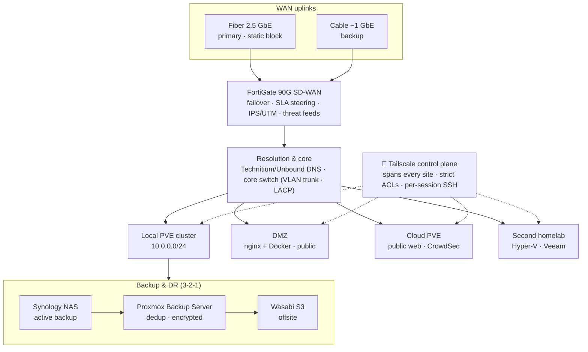
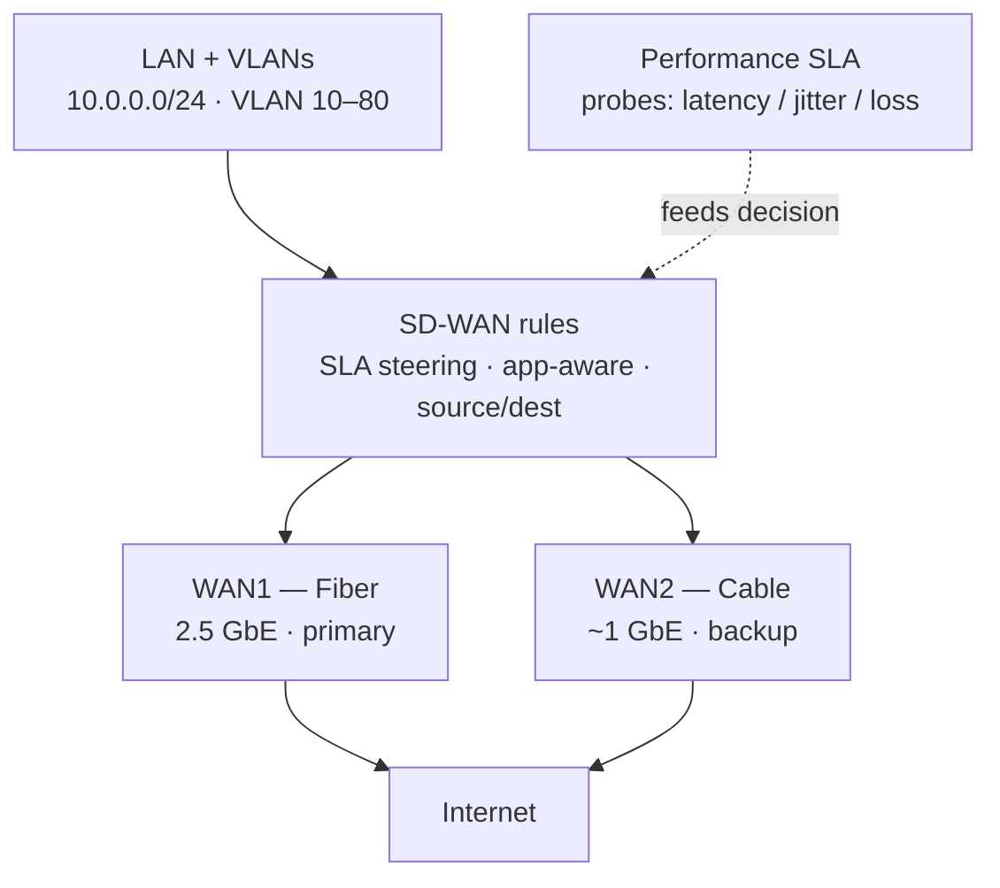

# 🌐 CKTech Networking Stack 👻🔥 — GhostKellz Edition

---

# 🔒 Overview

This section covers advanced **networking scripts**, **notes**, and **tuning configurations** for GhostKellz' home and cloud infrastructure.

Built on top of:
- 🛸️ **Tailscale** Zero-Trust mesh VPN — coordination plane for work infra + lab
- 🚱️ **Headscale + Tailscale client** (self-hosted control server) — **lab setting only**
- ⚡ **WireGuard** for blazing-fast peer-to-peer connections
- 🏰 **Fortigate 90G** firewall securing WAN and LAN edges
- 🌐 **SD-WAN** failover (Fiber + Cable) for redundant, always-on connectivity
- 🔵 **Unbound** DNS resolver with hardened root hints and DNSSEC validation

All optimized for:
- 🔒 Maximum Security
- 🌎 Global Mesh Networking
- 🚀 Fast failover and route optimization
- 🧹 Self-healing and automatic refresh systems
- Handling network sevice interruptions

---

# 🗺️ Global Topology

Two WAN links into a FortiGate edge, a local Proxmox cluster, a cloud node, a public
DMZ, and a second homelab — stitched together by a Tailscale control plane so
management never crosses the public internet.

> All infra comms (SSH, APIs, dashboards) ride the **Tailscale tailnet** with strict
> ACLs — management traffic never crosses the public internet. A self-hosted
> **Headscale + Tailscale client** runs alongside in a **lab setting only**. See
> [`tailscale.md`](tailscale.md) for the mesh, DERP relays, and OIDC details.

---

# 🛰️ SD-WAN Failover & SLA Steering

The FortiGate runs both WAN members and steers per-application traffic by live SLA
probes (latency / jitter / loss), failing over to cable if the fiber degrades.

> Dotted = the Performance SLA feeding the steering decision. Both members can carry
> traffic at once (load-balance by bandwidth ratio) or act as strict primary/backup,
> depending on the rule.

---

# ⚡ What's Inside

| Folder/File            | Purpose |
|-------------------------|---------|
| `tailscale.md`           | Tailscale/Headscale setup, tweaks, and peer configuration |
| `nftables.md`            | nftables performance tuning and security baseline |
| `unbound/`               | Local Unbound configuration for secure DNS resolution |
| `readme.md`              | (This file) Networking structure and overview |

---

# 🛠️ Future Plans
- Automated Fortigate API script integration
- Dynamic DNS failover using SD-WAN event hooks
- Headscale + WireGuard multi-hop relay and fallback system
- Mesh network monitoring, auto-healing, and route optimization
- Templated Unbound zone overrides for faster internal DNS resolution

---

> 🔥 **CKTech Networking: battle-tested, GhostKellz optimized.**  
> 👻 Stay encrypted. Stay resilient. Stay Secure. 
