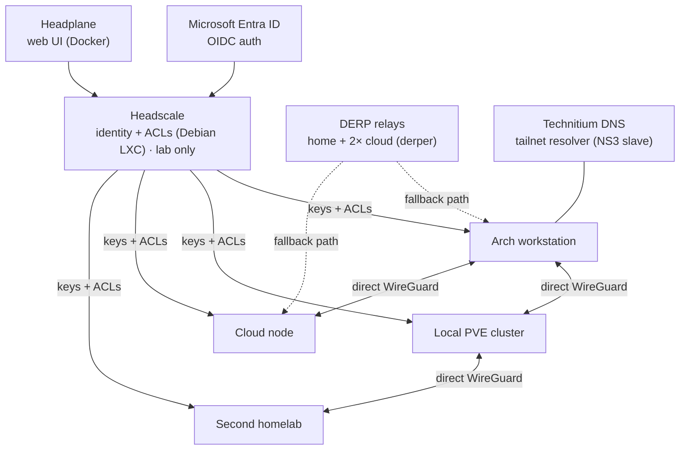

# 🌐 Tailscale on Arch (GhostKellz Edition)


---

# 📖 Overview

This section highlights the GhostKellz networking setup using **Tailscale** plus a
fleet of additional technologies to form a **zero-trust, resilient mesh** across cloud
and home infrastructure.

> **Tailscale** is the day-to-day coordination plane for work infra and the lab. A
> self-hosted **Headscale + Tailscale client** setup runs alongside it in a **lab
> setting only** — for experimentation, not production.

Built around:
- 🛡️ Tailscale client for encrypted device-to-device communication.
- 🧠 Headscale (self-hosted control server) in a lightweight Debian LXC — **lab use only**.
- 🛰️ Two custom DERP relays (Docker-based) across cloud and home for the **lowest possible latency**.
- 🧵 WireGuard tunnels acting as fallback links if Tailscale fails.
- 🌐 Vanilla NGINX servers: one public-facing, another internal for cloud service SSL termination (e.g., Hudu, UniFi).
- 🧬 Technitium DNS server acting as a Tailscale resolver (NS3 slave).
- 🔐 Full OIDC authentication via Microsoft Entra ID, powered by Headplane.

Infrastructure Highlights:
- Dual WAN SD-WAN failover (Fiber + Cable) 🛰️
- Fortigate 90G Firewall for LAN/WAN security 🔥
- Hourly Headscale snapshots via Proxmox Backup Server ☁️
- Full Home/Cloud Proxmox cluster linked with secure overlay networking 🌎

---

# 🧩 Trayscale GUI - Visualize Your Network

[Trayscale](https://github.com/DeedleFake/trayscale) is a **fantastic lightweight GUI** that interfaces with `tailscaled` and gives real-time visual feedback:

- Quick glance at peer status, relay paths, direct routes.
- Useful when debugging routing issues or DERP fallback behavior.
- Recommended for anyone wanting extra **network situational awareness**.

### Important Note ⚡
You must set yourself as a Tailscale "operator" first:
```bash
sudo tailscale set --operator=$USER
```

Otherwise, Trayscale will fail to connect to the local Tailscale daemon.

---

# 🛠️ Stack Components

| Service            | Details |
|--------------------|---------|
| **Tailscale**       | Encrypted overlay network |
| **Headscale**       | Self-hosted identity server (LXC container) |
| **WireGuard**       | Fallback encrypted tunnels |
| **DERP Servers**    | Home + 2 Cloud relays (Docker `derper`) |
| **NGINX**           | SSL termination, proxying cloud services |
| **Technitium DNS**  | Local authoritative + Tailscale resolver |
| **Headplane**       | OIDC-enabled Headscale web UI (Docker) |

---

# 🧬 Mesh Control Plane

The control server hands every node its keys and ACLs, then nodes build **direct
WireGuard tunnels** peer-to-peer; DERP relays only carry traffic when a direct path
can't be established, so most flows never touch a relay. Work infra runs on
**Tailscale**; the **Headscale** path below is the **lab-only** self-hosted equivalent.



> Direct WireGuard is the fast path; **DERP** is the fallback when NAT/firewalls block a
> direct route. Headscale config is snapshotted hourly to Proxmox Backup Server.

---

# 🔒 Security & High Availability
- OIDC login enforced with Microsoft Azure Entra ID
- Redundant DERP relay paths + direct WireGuard tunnels
- Local and cloud storage of Headscale config via Synology NAS + Veeam
- SDWAN failover with automatic connection switching
- SDWAN used to maintain DNS Resolution between a local Technitium DNS server with unbound and a Pihole + unbound in a proxmox LXC Container
- Uptime backed by multiple UPS units for servers + home system,  Standby Generator at home, SDWAN Technology for ISP interruptions 

---
## 📸 Showcasing The Setup

| Screenshot | Description |
|:-----------|:------------|
|  | Custom DERP Region Map View |
|  | Headplane Web UI (OIDC Login) |
|  | Live Peer Connection Graph |

---

> 👻 **GhostKellz Networking Stack**: Zero Trust. Maximum Resilience. Absolute Control.  
> 🛡️ _Stay encrypted. Stay sovereign._

---

> 👻 **GhostKellz Networking Stack**: Zero Trust. Maximum Resilience. Absolute Control.
>  
> 🛡️ _Stay encrypted. Stay sovereign._


---

> ✨ **GhostKellz Networking Stack: Zero Trust. Maximum Resilience. Absolute Control.**

> 👻 *Stay encrypted. Stay sovereign.*
