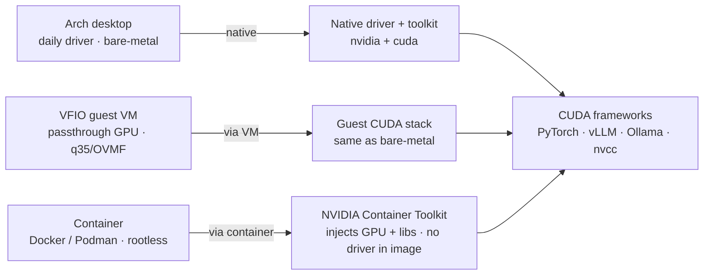
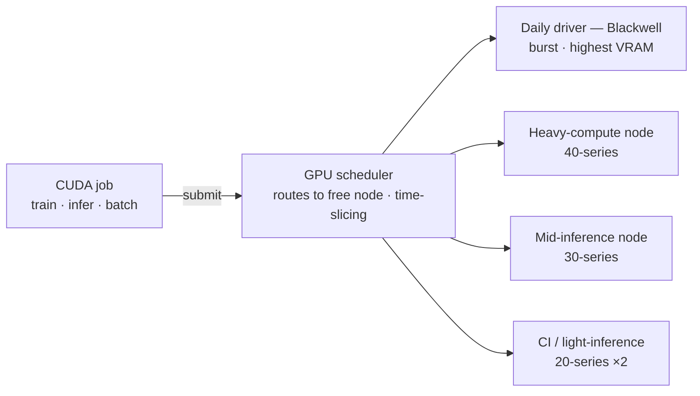

# NVIDIA Performance & Tweaks 🔥🌐🛠️


---

## 🔍 About

This section provides custom **Wayland** fixes, gaming optimizations, NVENC improvements, and overall performance tuning focused on **NVIDIA RTX 5090** (Blackwell) systems, with the same tuning applied across the 40/30/20-series cards in the Proxmox cluster.

Built for **Arch Linux** users who demand top-tier performance and maximum stability.

GhostKellz Certified. 👻✅

### Topics Covered:
- 🛠️ Compatibility fixes for Wayland and NVIDIA Open 610 drivers
- 🎮 Gaming optimization and OBS streaming tweaks
- 🎥 NVENC encoding improvements
- 🖥️ Monitor/refresh rate fixes under Wayland

---

## ⚙️ Structure Overview

| Folder / File               | Purpose                                    |
|------------------------------|--------------------------------------------|
| `gamescope/`                 | Tweaks for Gamescope environments         |
| `wayland/`                   | Specific Wayland fixes for NVIDIA drivers |
| `fixes.md`                   | General fixes and workaround notes        |
| `gaming.md`                  | OBS/Game-focused performance tips         |
| `container-toolkit.md`        | NVIDIA Container Toolkit — how/benefits/when |
| `modprobe-nvidia.conf`        | Kernel module options (disable GSP)       |
| `nvenc.md`                   | NVENC performance tuning                  |
| `nvidia.conf`                 | Xorg/NVIDIA config overrides              |

---

## 🚀 Quick Highlights

- 🔥 **Disables unstable GSP firmware** on Open drivers
- 📈 **Unlocks maximum gaming performance** on Wayland
- 🎥 **Optimizes NVENC** for high-quality OBS recording
- 🧹 **Cleans up environment variables** for Gamescope/Wayland

---

## 📍 Usage Example

Most configs are meant to be copied into your local `/etc/modprobe.d/`, `/etc/X11/xorg.conf.d/`, or sourced manually in gaming sessions (e.g., environment tweaks).

Example:
```bash
sudo cp modprobe-nvidia.conf /etc/modprobe.d/nvidia.conf
sudo cp nvidia.conf /etc/X11/xorg.conf.d/20-nvidia.conf
```

For Wayland environment variables, you can source them via your session launcher or `.zshrc`.

---

## 🚧 Warnings
- **Built for modern RTX cards (40/50 series).**
- **Assumes a recent kernel (7.0+) and NVIDIA Open 610 drivers.**
- **Wayland performance may vary based on compositor (KDE/Hyprland/Gamescope).**

> Use at your own risk — but works well on daily driver. 20/30 series cards require a bit more. I've virtualized so kvm + vfio gpu passtrhrough + looking glass and I can get a 2060 and a 3070 to work well on wayland but in my experience 40/50 series cards are less work and less finicky overall.

Daily Driver: 9950x3d RTX 5090 - Arch KDE Nvidia Open 610 branch and CachyOS Kernel 7.0

## Proxmox Hosts
PVE1 VMhost1 - 14900k/RTX 4090 - Arch GPU passthrough via vfio + looking glass. Hosts ollama and openwebUI mostly server and AI stuff. 
PVE2 VMhost2 - 5900x / RTX 3070 - Arch KDE, vfio passthrough and zen kernel. Mostly a testbed for arch + nvidia 
PVE3 Vmhost3 - 12900kf / RTX 2060 - VM running popOS cosmic and previously fedora. Mostly just testing other distros out with older nvidia hardware.

---

## 🧮 GPU Compute & CUDA

One CUDA toolchain, delivered to bare-metal, VMs, and containers alike — every path
converges on the same frameworks, so code moves between contexts unchanged.



The container path never bakes a driver into the image — the toolkit injects the GPU
and libraries at run, so images stay portable across whichever card is free.

### CUDA across the Proxmox cluster

Jobs land on whichever node has a free card. AMD (RX 570) and iGPU-only nodes sit
outside the CUDA pool and take non-CUDA work.



> The driver lives in exactly one place per context — native on the desktop, inside
> the VFIO guest, and *never* in a container image. Same mechanism that powers
> Looking Glass (see [`../virtualization/gpu-passthrough.md`](../virtualization/gpu-passthrough.md)).

For the container path — how the toolkit injects the GPU, benefits, and when to use it
vs native/VFIO — see [`container-toolkit.md`](container-toolkit.md).

---

## 📈 Future Work
- Vulkan layer performance enhancements
- Full Hyprland-specific profiles
- DLSS + OBS workflows

---

> This project is actively evolving alongside my personal system upgrades. 
> Expect rapid improvements, better automation, and even deeper tuning scripts. 👻🚀
