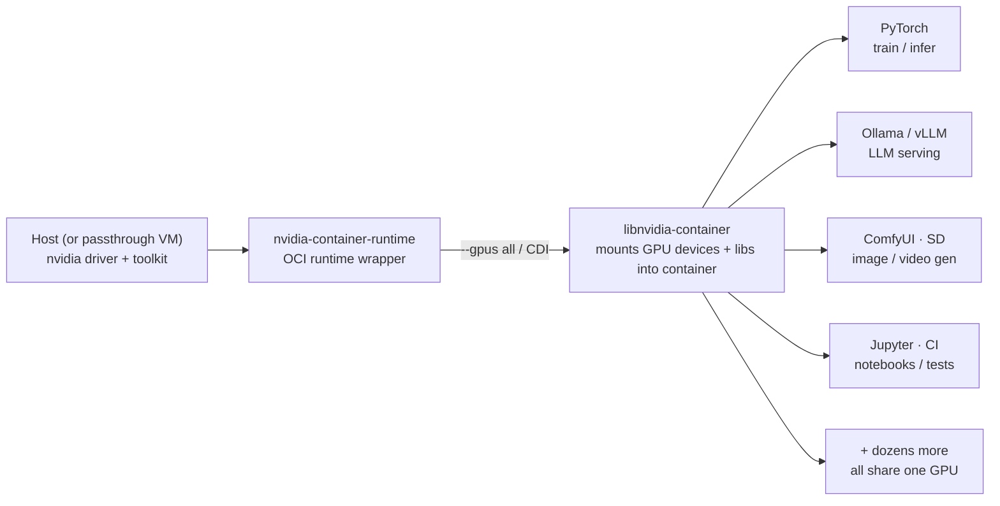
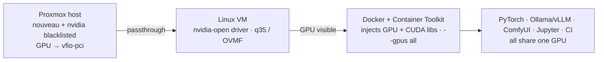
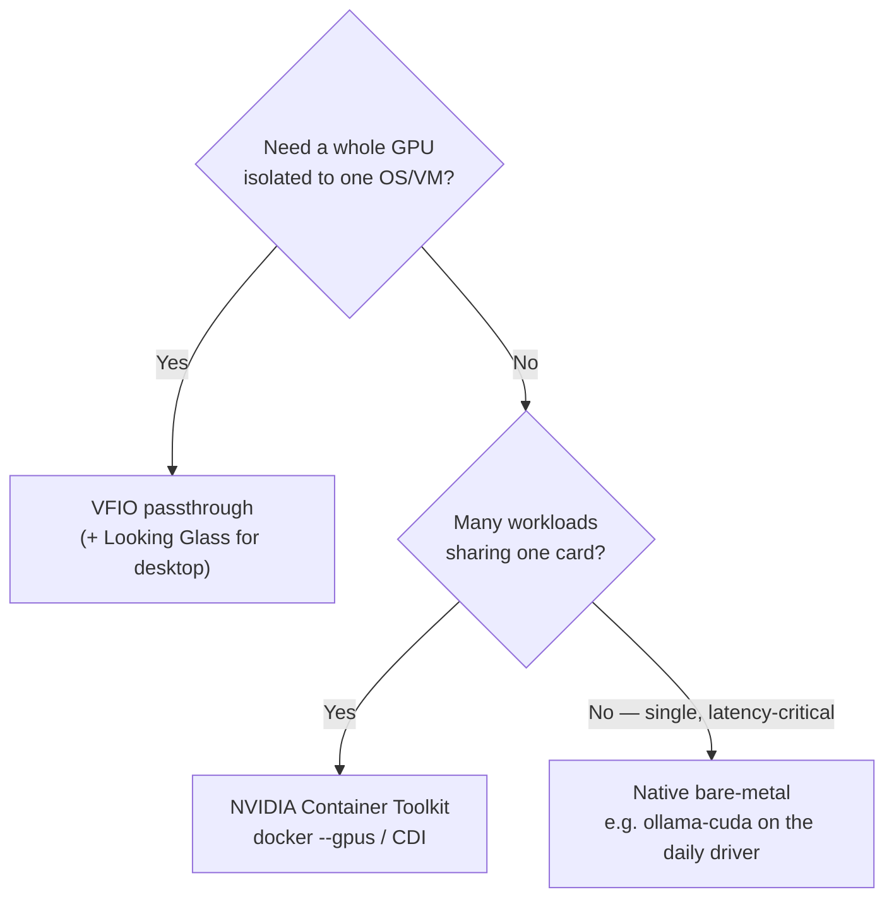

# NVIDIA Container Toolkit

One GPU, many workloads. The NVIDIA Container Toolkit lets dozens of containers share a
single card by **injecting the GPU and driver libraries into the container at runtime** —
no driver is ever baked into the image. The same mechanism works on bare-metal Arch and
inside a Proxmox passthrough VM.

> This doc is the conceptual / "how we use it" view with diagrams. For the Arch config,
> `daemon.json`, CDI specs, and post-driver-update fixes, see
> [`../kb/nvidia-container-runtime.md`](../kb/nvidia-container-runtime.md) and
> [`../system/docker.md`](../system/docker.md).

---

## How it works — one GPU, many containers



The image stays **driver-free and portable** — the toolkit injects whatever driver the
host has at `docker run` time, so the same image runs on the 5090 desktop, a 4090 VM, or
a 2060 CI node without rebuilds.

---

## Where the driver lives


Compare the three CUDA delivery paths (full picture in
[`README.md` → GPU Compute & CUDA](README.md#-gpu-compute--cuda)):

| Path | Driver location | Image | Best for |
|------|-----------------|-------|----------|
| **Native bare-metal** | host | n/a | daily driver, lowest latency, single-tenant |
| **VFIO passthrough VM** | guest VM | n/a | isolation, a full GPU per VM |
| **Container toolkit** | host/VM (injected) | driver-free | many workloads sharing one card, portability, CI |

---

## Proxmox VM + toolkit (the common cluster pattern)

A GPU is passed to a Linux VM via `vfio-pci`; inside that VM the driver + toolkit let
many containers fan out over the single card.



---

## Benefits

- **One card, many tenants** — dozens of containers time-share a GPU instead of
  dedicating it to one process.
- **Portable images** — no driver baked in; the same image runs across every node
  regardless of its installed driver version.
- **Driver/image decoupling** — upgrade the host driver without rebuilding images;
  CUDA libs are injected at run.
- **Reproducible CI** — light-inference and test jobs on the 30/20-series nodes run the
  exact same image as production.
- **Works inside passthrough VMs** — pairs with VFIO for isolation *and* fan-out.

---

## When to use which



- **Native** — daily-driver inference where latency matters and there's one tenant
  (this is why `ollama-cuda` runs native on the 5090, not in a container).
- **Container toolkit** — many concurrent GPU workloads, CI, or anything that benefits
  from portable images sharing a card.
- **VFIO** — when a guest needs the *whole* GPU and hard isolation (Windows gaming,
  a dedicated inference VM).

---

## Quick reference

```bash
# Install (Arch)
yay -S nvidia-container-toolkit

# Smoke test — GPU visible inside a container
docker run --rm --gpus all nvidia/cuda:13.0-base nvidia-smi
```

Full configuration, CDI generation, and the "broke after a driver update" fix workflow:
[`../kb/nvidia-container-runtime.md`](../kb/nvidia-container-runtime.md).

---

## Related

- [GPU Compute & CUDA](README.md#-gpu-compute--cuda) — the three delivery paths
- [VFIO GPU Passthrough](../virtualization/gpu-passthrough.md)
- [`../kb/nvidia-container-runtime.md`](../kb/nvidia-container-runtime.md) — config + fixes
- [`../system/docker.md`](../system/docker.md) — Docker GPU setup
