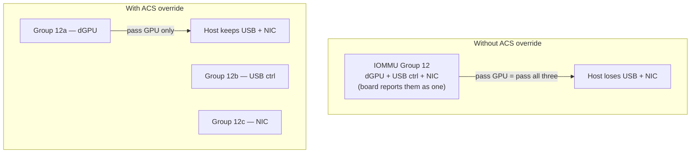
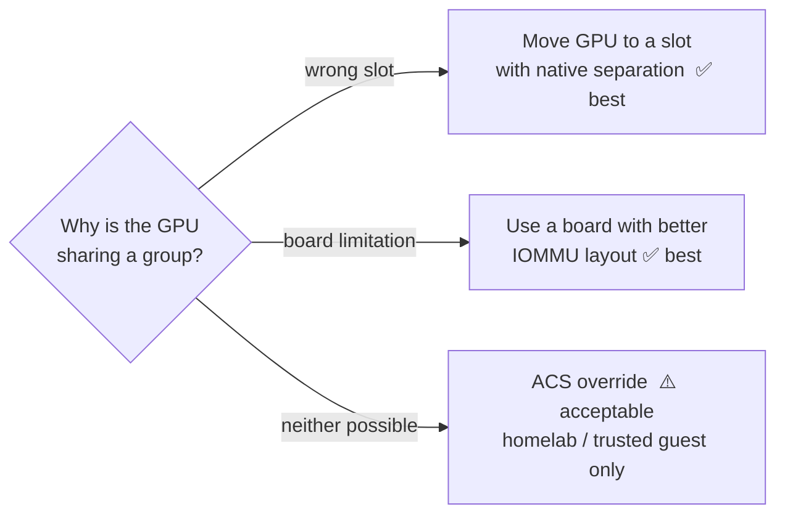

# ACS Override Patch

The ACS (Access Control Services) override patch artificially **splits IOMMU groups** that
the motherboard lumps together, so you can isolate a single device (usually a GPU) that
would otherwise drag unrelated controllers into the guest. It's a kernel patch, not a
mainline feature — it relaxes the kernel's view of which devices are isolated.

> **My take:** in practice the ACS override has been **mostly reliable** for me on the
> boards I've tested it on — no data corruption, GPUs isolate cleanly, guests behave. But
> I almost never reach for it. On every workstation and even the high-end *consumer*
> components I run as Proxmox servers, I deliberately buy **feature-rich motherboards with
> good native IOMMU separation**, so the [clean-grouping path](iommu.md) just works out of
> the box. The patch is a fallback I keep in my back pocket, not the default.

---

## What it does



The kernel now *treats* the devices as separately isolatable. The catch: the hardware
isn't actually enforcing that isolation, so it's a trust decision (see Trade-offs).

---

## Enabling it

Requires a kernel built with the ACS-override patch (many enthusiast/Arch kernels such as
`linux-zen` and CachyOS variants ship it). Add to the kernel command line:

```
pcie_acs_override=downstream,multifunction
```

| Value | Effect |
|-------|--------|
| `downstream` | Split groups for downstream ports of PCIe switches |
| `multifunction` | Treat each function of a multifunction device as isolatable |
| `id:VVVV:DDDD` | Override for a specific vendor:device only (narrowest, safest) |

Reboot and re-check groups with the script in [`iommu.md`](iommu.md) — the previously
fused devices should now sit in their own groups.

---

## Trade-offs



- **Pro:** unlocks passthrough on boards that otherwise can't isolate the card; reliable
  in practice for a trusted single-user homelab/Proxmox setup.
- **Con:** the split is **not hardware-enforced** — devices the IOMMU *thinks* are
  isolated could still DMA to each other. Don't rely on it as a **security boundary**
  between untrusted tenants.

**Preference order:** (1) correct slot placement → (2) a board with native separation →
(3) ACS override only when neither is available. Because I pick boards with good IOMMU
layout from the start, I almost always land on option 1 or 2.

---

## Related

- [IOMMU & Device Groups](iommu.md) — how grouping works (the path I default to)
- [VFIO GPU Passthrough](gpu-passthrough.md) — bind the group and build the guest
