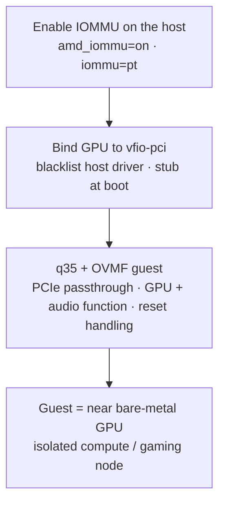
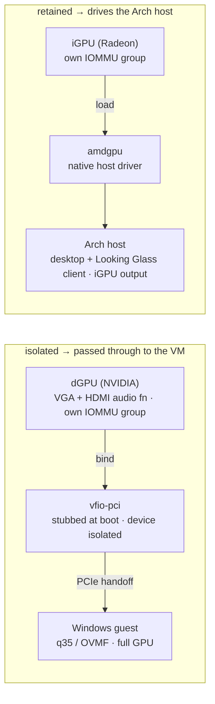

# VFIO GPU Passthrough

Hand a real GPU to a guest VM at near bare-metal speed. The host blacklists the card,
binds it to `vfio-pci`, and a q35/OVMF guest drives it directly. Pair it with
[Looking Glass](looking-glass/README.md) for a lossless, low-latency desktop with no
network hop.

> Daily-driver split here is a dual-GPU box: a **Radeon iGPU drives the Arch host**
> while the **NVIDIA dGPU is isolated and passed to a Windows guest**. The same
> mechanism runs on the Proxmox cluster (PVE1 4090, PVE2 3070, PVE3 2060).

---

## The workflow



---

## Where the GPU driver lives

The key idea: the driver lives in **exactly one place** per card. The host stays out
of the way of any device it intends to pass through.



---

## 1. Enable IOMMU

Add to the kernel command line (CachyOS/`linux-cachyos` via `/etc/default/grub` or
your bootloader's entry). AMD shown; Intel uses `intel_iommu=on`.

```
amd_iommu=on iommu=pt
```

Verify after reboot:

```bash
dmesg | grep -i -e DMAR -e IOMMU
for d in /sys/kernel/iommu_groups/*/devices/*; do
  echo "Group $(basename $(dirname $(dirname $d))): $(lspci -nns ${d##*/})"
done
```

The card you intend to pass through should sit in a **clean IOMMU group** (ideally
only the GPU + its HDMI audio function). If it shares a group with other devices, you
may need ACS override (use sparingly — it weakens isolation). See
[`iommu.md`](iommu.md) for how groups work and why board choice matters.

## 2. Find the device IDs

```bash
lspci -nn | grep -i -e VGA -e Audio
# e.g. 01:00.0 VGA [10de:2684]  /  01:00.1 Audio [10de:22ba]
```

## 3. Bind to vfio-pci

`/etc/modprobe.d/vfio.conf` — stub the device by ID so the host never grabs it:

```
options vfio-pci ids=10de:2684,10de:22ba
softdep nvidia pre: vfio-pci
softdep drm pre: vfio-pci
```

Blacklist the host NVIDIA driver if the dGPU must never bind to it:

```
# /etc/modprobe.d/blacklist-nvidia.conf
blacklist nvidia
blacklist nvidia_drm
blacklist nvidia_modeset
```

Ensure `vfio-pci` loads early. With `mkinitcpio`, add to `MODULES` in
`/etc/mkinitcpio.conf`:

```
MODULES=(vfio_pci vfio vfio_iommu_type1)
```

Then rebuild and reboot:

```bash
sudo mkinitcpio -P
```

Confirm the binding:

```bash
lspci -nnk -d 10de:2684
# Kernel driver in use: vfio-pci   ✅
```

## 4. q35 + OVMF guest

Create the VM with:

- **Chipset:** q35
- **Firmware:** OVMF (UEFI) — required for modern GPU passthrough
- **CPU:** host-passthrough
- Add the GPU **and** its audio function as PCI host devices (same IOMMU group).

For NVIDIA guests historically hit by Code 43, hide the hypervisor (modern drivers are
mostly fine, but kept for reference):

```xml
<features>
  <hyperv>
    <vendor_id state="on" value="1234567890ab"/>
  </hyperv>
  <kvm>
    <hidden state="on"/>
  </kvm>
</features>
```

### Reset handling

Some GPUs don't reset cleanly between guest reboots (the "reset bug"). Mitigations:

- Keep the GPU bound to `vfio-pci` only (never let the host driver touch it).
- For affected AMD cards, `vendor-reset` (DKMS) provides a function-level reset.
- Avoid host display managers fighting over the passed-through card.

---

## Related

- [IOMMU & Device Groups](iommu.md) — how grouping works and why hardware choice matters
- [Looking Glass](looking-glass/README.md) — lossless guest→host desktop over IVSHMEM
- [`kvm.md`](kvm.md) — QEMU/KVM & virt-manager
- [`libvirt.md`](libvirt.md) — libvirt setup
- [`../nvidia/README.md`](../nvidia/README.md) — GPU Compute & CUDA across the cluster
