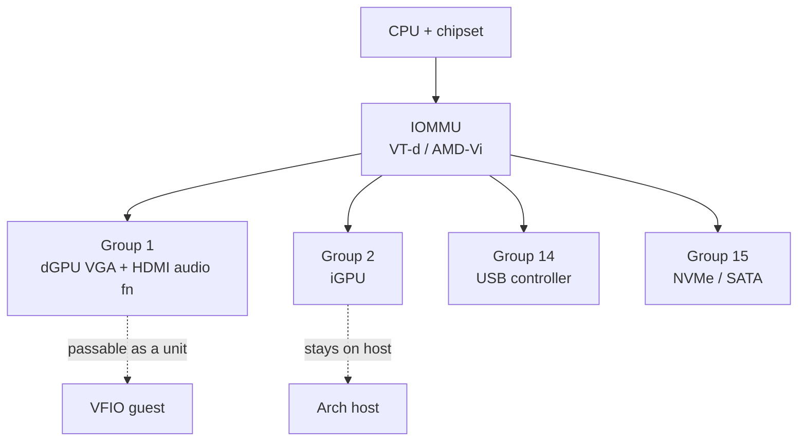
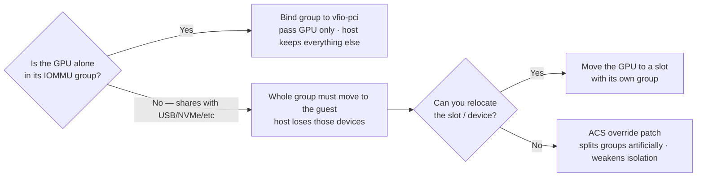

# IOMMU & Device Groups

The IOMMU (Intel VT-d / AMD-Vi) is what makes safe GPU passthrough possible. It sits
between PCIe devices and system memory, translating device DMA addresses and — crucially
for VFIO — **grouping devices** by the smallest set that can be isolated from each other.
You can only pass through a **whole IOMMU group** at once, so the layout of those groups
decides whether passthrough is clean or painful.

> **Hardware choice matters.** I deliberately buy motherboards/CPUs with good IOMMU
> separation (each PCIe slot and the major controllers in their own groups). On boards
> with poor grouping you end up needing ACS-override hacks, which weaken the isolation
> guarantee. Good silicon up front avoids that entirely.

---

## What an IOMMU group is

A group is the **smallest set of devices the IOMMU can isolate as a unit**. If the GPU
shares a group with, say, a USB controller, then passing the GPU to a VM means the USB
controller goes too — the host can't keep it.



A **clean group** for passthrough holds only the GPU and its own audio function. That's
the goal.

---

## Why grouping matters for VFIO



The right answer is almost always **better hardware/slot placement**, not ACS override.

---

## Enable IOMMU

Kernel command line:

| Platform | Parameters |
|----------|------------|
| AMD      | `amd_iommu=on iommu=pt` |
| Intel    | `intel_iommu=on iommu=pt` |

`iommu=pt` (pass-through mode) leaves host-owned devices unmediated for performance and
only enforces translation where needed.

---

## Inspect your groups

```bash
#!/usr/bin/env bash
# List every IOMMU group and the devices in it
shopt -s nullglob
for g in /sys/kernel/iommu_groups/*/devices/*; do
  grp=$(basename "$(dirname "$(dirname "$g")")")
  printf 'IOMMU Group %s: ' "$grp"
  lspci -nns "${g##*/}"
done | sort -V
```

Read it like this:

- The **GPU and its HDMI audio function** should share one group and ideally nothing
  else. That group is what you bind to `vfio-pci`.
- If unrelated controllers appear in the same group, that's the warning sign.

---

## ACS override (last resort)

When a board lumps too much into one group, the ACS-override kernel patch can split
groups artificially:

```
pcie_acs_override=downstream,multifunction
```

Trade-offs:

- **Pro:** lets you isolate a GPU on a board that otherwise can't.
- **Con:** the split is not enforced by hardware — devices that the IOMMU *thinks* are
  isolated may still DMA to each other. Fine for a homelab/trusted guest, **not** a
  security boundary.

Prefer, in order: (1) a different PCIe slot, (2) a different board/CPU with native
separation, (3) ACS override only if neither is possible. Full write-up:
[`acs_patch.md`](acs_patch.md).

---

## Related

- [VFIO GPU Passthrough](gpu-passthrough.md) — bind the group and build the guest
- [ACS Override Patch](acs_patch.md) — splitting stubborn groups (fallback)
- [Looking Glass](looking-glass/README.md) — view the passthrough guest losslessly
- [`kvm.md`](kvm.md) · [`libvirt.md`](libvirt.md)
