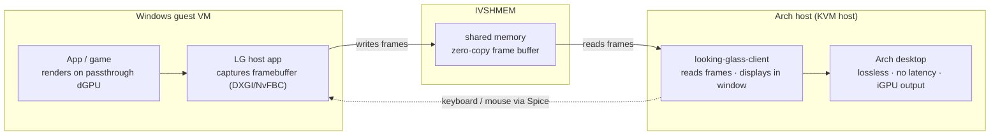
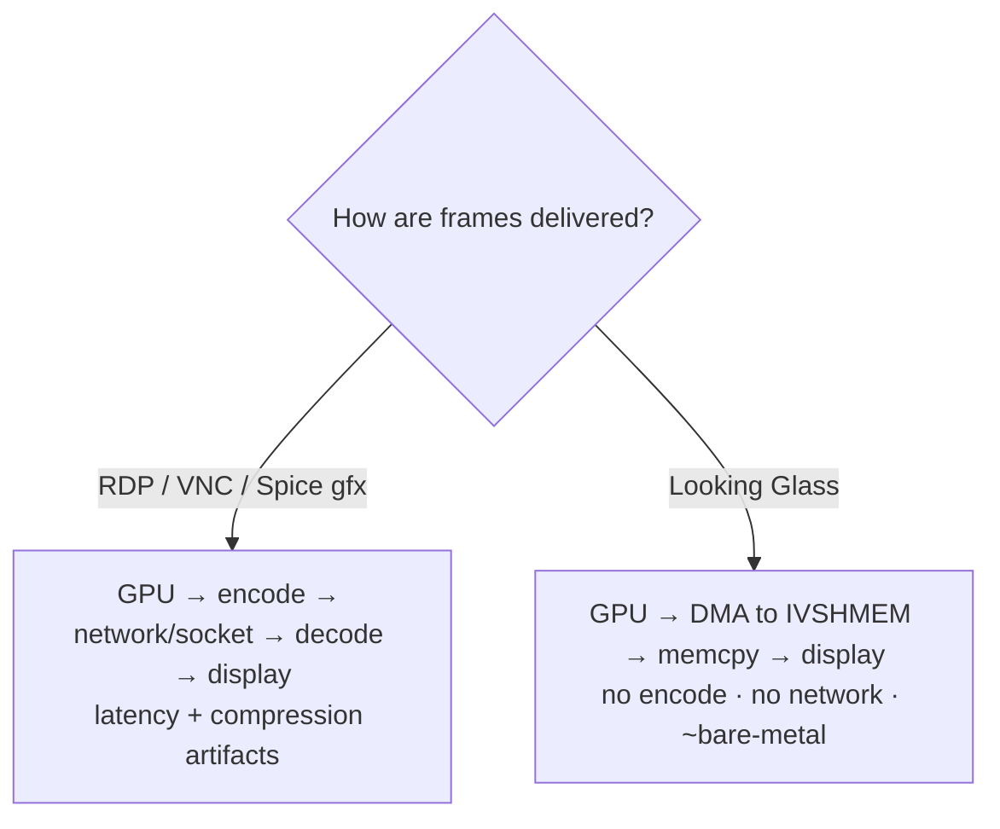
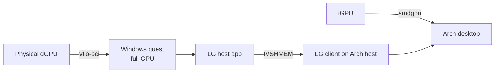

# Looking Glass

Looking Glass turns a VFIO GPU-passthrough VM into a **window on your Linux desktop**.
Instead of a second monitor and a KVM switch, the guest renders to a virtual display,
copies each frame into a shared-memory region (IVSHMEM), and a host-side client reads
those frames with **zero network hop and no video encode** — an uncompressed,
near bare-metal desktop sitting in a window right next to your Linux apps.

> Daily-driver use: the Arch host runs on its **iGPU**, the **dGPU is passed to a
> Windows guest** ([VFIO passthrough](../gpu-passthrough.md)), and Looking Glass
> mirrors that guest back as a lossless desktop. 3D apps and CUDA workloads inside
> Windows run at effectively bare-metal performance.

---

## Docs in this directory

| File | Purpose |
|------|---------|
| [`README.md`](README.md) | Overview + architecture flowcharts (this file) |
| [`setup.md`](setup.md) | Install + configure host client and guest host-app |
| [`usage.md`](usage.md) | Daily usage, keybinds, Spice input, clipboard |
| [`troubleshooting.md`](troubleshooting.md) | Common failures and fixes |

---

## How it works

Frames never leave RAM. The guest captures its framebuffer, writes it into the
IVSHMEM device, and the host client reads from the same region — a single
shared-memory copy, no compression, no network.

- **Dotted path** = input (keyboard/mouse) fed back to the guest over Spice.
- Frames are **uncompressed** and **never leave RAM**.

---

## Data flow vs. a normal remote desktop

The win is the absence of an encode/decode round-trip: Looking Glass is a memory copy,
not a codec.

---

## Where it fits

The host display is driven by the iGPU; Looking Glass simply adds the guest's screen
as another window on that desktop.

---

## Related

- [VFIO GPU Passthrough](../gpu-passthrough.md) — the prerequisite: isolate + pass the dGPU
- [`../kvm.md`](../kvm.md) — QEMU/KVM & virt-manager
- [Setup →](setup.md)
