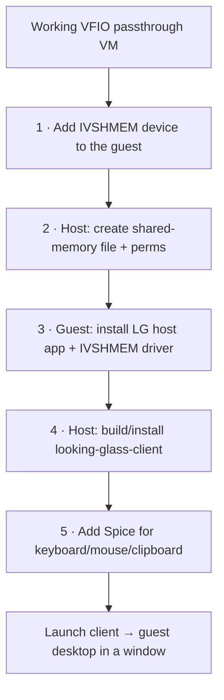

# Looking Glass — Setup

Prerequisite: a working [VFIO GPU passthrough](../gpu-passthrough.md) VM that boots and
shows a display through the passed-through GPU (a virtual display, dummy HDMI plug, or
the guest GPU's own output). Looking Glass replaces the *viewing* step — it does not
replace passthrough.



---

## 1. Add the IVSHMEM device (guest XML)

Size the region for your resolution: `width × height × 4 × 2`, rounded up to the next
power of two, in MB. 1080p ≈ 32 MB, 1440p ≈ 64 MB, 4K ≈ 128 MB.

In the libvirt domain XML (`virsh edit <vm>`), inside `<devices>`:

```xml
<shmem name='looking-glass'>
  <model type='ivshmem-plain'/>
  <size unit='M'>128</size>
</shmem>
```

## 2. Host: shared-memory file + permissions

Create the SHM file at boot with your user owning it. `/etc/tmpfiles.d/10-looking-glass.conf`:

```
#Type Path               Mode UID  GID Age Argument
f /dev/shm/looking-glass 0660 chris kvm -
```

Apply without reboot:

```bash
sudo systemd-tmpfiles --create /etc/tmpfiles.d/10-looking-glass.conf
ls -l /dev/shm/looking-glass
```

## 3. Guest (Windows): host application

Inside the Windows guest:

1. Install the **IVSHMEM driver** (from the VirtIO driver ISO, or LG's signed driver)
   for the "PCI standard RAM Controller" device in Device Manager.
2. Install the **Looking Glass host application** (`looking-glass-host-setup.exe`),
   matching the **same B-version** as your host client (e.g. both B7).
3. Set the LG host service to start automatically.

A virtual display or a dummy HDMI/DP plug is needed so the guest GPU always has a
display to render — otherwise the framebuffer is blank when no monitor is attached.

## 4. Host (Arch): client

```bash
# AUR
yay -S looking-glass

# or build from source (B-version must match the guest host app)
sudo pacman -S cmake gcc fontconfig libglvnd spice-protocol nettle \
  wayland wayland-protocols libxi libxinerama libxss libxcursor libxpresent
git clone --branch B7 https://github.com/gnif/LookingGlass.git
cd LookingGlass/client && mkdir build && cd build
cmake -DCMAKE_BUILD_TYPE=Release ..
make -j$(nproc)
```

## 5. Spice (input + clipboard)

Add a Spice server and an `ich9`/`ich6` virtio mouse/keyboard channel so the client can
forward keyboard, mouse, and clipboard back to the guest. In the domain XML:

```xml
<graphics type='spice' autoport='yes'>
  <listen type='address'/>
  <image compression='off'/>
</graphics>
<channel type='spicevmc'>
  <target type='virtio' name='com.redhat.spice.0'/>
</channel>
```

Looking Glass uses the Spice channel **only for input/clipboard**, not for video — the
video comes through IVSHMEM.

---

## Launch

```bash
looking-glass-client -F            # -F = full screen
# or with a config file: ~/.config/looking-glass/client.ini
```

Minimal `~/.config/looking-glass/client.ini`:

```ini
[app]
shmFile=/dev/shm/looking-glass

[win]
fullScreen=yes
autoResize=yes

[spice]
enable=yes
clipboard=yes

[input]
escapeKey=KEY_RIGHTCTRL
```

---

## Next

- [Daily usage & keybinds →](usage.md)
- [Troubleshooting →](troubleshooting.md)
