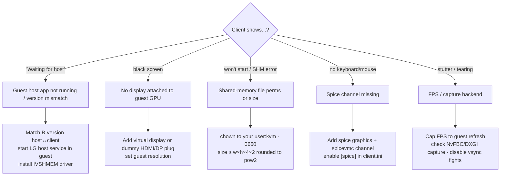

# Looking Glass — Troubleshooting



---

## "Waiting for host"

The client connects to IVSHMEM but no guest is writing frames.

- **Version mismatch** is the #1 cause — the guest host app and the host client must be
  the **same B-version** (B7 ↔ B7). Reinstall the matching pair.
- The **LG host service** isn't running in the guest. Start it (set to automatic).
- The **IVSHMEM driver** isn't bound to the "PCI standard RAM Controller" in the guest's
  Device Manager.

## Black screen / no image

The guest GPU has no display to render to.

- Attach a **virtual display** (Windows) or a **dummy HDMI/DP dongle** to the
  passed-through GPU.
- Confirm the guest actually has a resolution set on that display.
- Verify the GPU is the active render device for the foreground app.

## Client won't start / SHM errors

```bash
ls -l /dev/shm/looking-glass
# must be owned by your user, group kvm, mode 0660
sudo systemd-tmpfiles --create /etc/tmpfiles.d/10-looking-glass.conf
```

- File **too small** for the resolution → increase `<size>` in the IVSHMEM device and
  the tmpfiles entry to match.
- Permissions wrong → fix owner/group/mode; the client runs as your user.

## No keyboard / mouse

- The Spice graphics device and `spicevmc` channel must exist in the domain XML.
- `[spice] enable=yes` in `client.ini`.
- Press the **escape key + `I`** to (re)capture input.

## Stutter, tearing, low FPS

- Cap client FPS to the guest's refresh rate.
- Prefer **NvFBC** capture on NVIDIA guests (faster than DXGI) where available.
- Disable competing vsync between guest app, LG host, and the client.
- Confirm IVSHMEM size gives a full double-buffer for the resolution.

## Code 43 / GPU not initializing in guest

This is a **passthrough** problem, not Looking Glass — see
[VFIO GPU Passthrough → reset handling](../gpu-passthrough.md). Hide the hypervisor and
confirm the GPU is bound to `vfio-pci` on the host.

---

## Related

- [Setup](setup.md)
- [Usage](usage.md)
- [VFIO GPU Passthrough](../gpu-passthrough.md)
