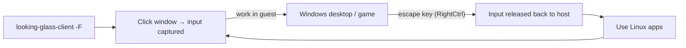

# Looking Glass — Daily Usage

Once the client is running you interact with the guest as if it were a native window.



---

## Keybinds

The **escape key** (default `ScrollLock`, set to `RightCtrl` in the example config)
toggles input capture and prefixes all LG shortcuts. With the escape key held:

| Shortcut | Action |
|----------|--------|
| `Esc` + `F` | Toggle full screen |
| `Esc` + `I` | Toggle capture mouse/keyboard |
| `Esc` + `N` | Toggle on-screen display (FPS / stats) |
| `Esc` + `Q` | Quit the client |
| `Esc` + `R` | Rotate the display |
| `Esc` + `D` | Toggle FPS limiter |

(Exact binds depend on LG version — check `looking-glass-client --help` and the OSD.)

---

## Input modes

- **Captured mouse** — relative mode, best for games (cursor locked to the window).
- **Released** — normal desktop cursor shared with the host; good for productivity.
- Toggle with the escape-key + `I` combo, or just move out of a non-fullscreen window.

## Clipboard

With Spice enabled (`[spice] clipboard=yes`), text copies across host↔guest both ways.
File transfer is **not** part of the clipboard path — use a shared folder, virtio-fs,
or the network for files.

## Performance notes

- **Uncompressed frames** — bandwidth is RAM bandwidth, not network. No artifacts.
- **Frame latency** is one shared-memory copy; sub-frame in practice.
- A **dummy plug or virtual display** keeps the guest GPU rendering at full rate even
  with no physical monitor attached.
- Match the **B-version** of host app and client, or capture silently fails.
- Cap the client FPS to the guest refresh rate to avoid wasted GPU/CPU.

## Audio

Looking Glass B6+ carries audio over the same shared-memory transport (Spice audio also
works as a fallback). Enable in `client.ini`:

```ini
[audio]
periodSize=2048
```

---

## Related

- [Setup](setup.md)
- [Troubleshooting](troubleshooting.md)
